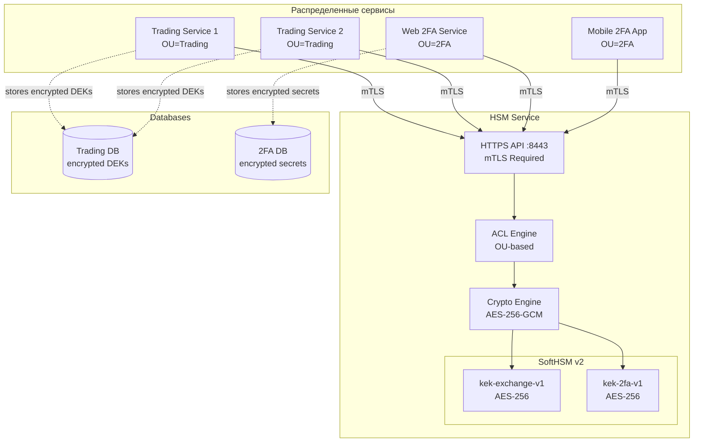

# HSM Service - Architecture Documentation

## Оглавление
1. [Обзор системы](#обзор-системы)
2. [Компоненты архитектуры](#компоненты-архитектуры)
3. [Управление конфигурацией](#управление-конфигурацией)
4. [Криптографическая архитектура](#криптографическая-архитектура)
5. [Сетевая архитектура](#сетевая-архитектура)
6. [Управление доступом (ACL)](#управление-доступом-acl)
7. [PKI Инфраструктура](#pki-инфраструктура)
8. [Потоки данных](#потоки-данных)
9. [Безопасность](#безопасность)
10. [Масштабирование и отказоустойчивость](#масштабирование-и-отказоустойчивость)

---

## Обзор системы

### Назначение

Централизованный криптографический сервис для шифрования/расшифрования данных с использованием Hardware Security Module (SoftHSM v2). Сервис предоставляет безопасное хранилище для Key Encryption Keys (KEK) и выполняет криптографические операции для распределенных систем.

### Контекст использования



### Проблема, которую решаем

**До внедрения HSM:**
- KEK хранились в конфигах распределенных сервисов
- Каждый сервис имел локальную копию KEK
- Невозможность централизованной ротации ключей
- Высокий риск компрометации при утечке конфига

**После внедрения HSM:**
- ✅ KEK НИКОГДА не покидает HSM
- ✅ Централизованное управление ключами
- ✅ Простая ротация KEK без обновления сервисов
- ✅ Аудит всех криптографических операций
- ✅ mTLS + ACL для авторизации

---

## Компоненты архитектуры

### High-Level Architecture


### Структура проекта

```
hsm-service/
├── cmd/
│   └── hsm-admin/              # CLI утилита для управления KEK
│       └── main.go
│
├── internal/
│   ├── config/                 # Конфигурация
│   │   ├── config.go           # Загрузка config.yaml и metadata.yaml
│   │   └── types.go            # Типы конфигурации и метаданных
│   │
│   ├── hsm/                    # PKCS#11 и криптография
│   │   ├── pkcs11.go           # Инициализация SoftHSM
│   │   ├── crypto.go           # Encrypt/Decrypt логика
│   │   ├── kek.go              # Управление KEK
│   │   └── types.go            # Криптографические типы
│   │
│   ├── server/                 # HTTP сервер
│   │   ├── server.go           # HTTP server setup
│   │   ├── handlers.go         # /encrypt, /decrypt endpoints
│   │   ├── acl.go              # ACL проверки по OU
│   │   ├── middleware.go       # Rate limit, audit log
│   │   └── types.go            # Request/Response структуры
│   │
│   └── revocation/             # Управление отозванными сертификатами
│       ├── crl.go              # Certificate Revocation List
│       └── loader.go           # Загрузка revoked.yaml
│
├── pki/                        # PKI инфраструктура
│   ├── ca/                     # CA сертификаты
│   ├── server/                 # Серверные сертификаты
│   ├── client/                 # Клиентские сертификаты
│   ├── scripts/                # Скрипты для PKI
│   ├── inventory.yaml          # Список всех сертификатов
│   └── revoked.yaml            # Список отозванных сертификатов
│
├── scripts/
│   ├── init-hsm.sh             # Инициализация SoftHSM token
│   ├── rotate-key-auto.sh      # Автоматическая ротация ключей
│   ├── rotate-key-interactive.sh # Интерактивная ротация
│   ├── cleanup-old-keys.sh     # Очистка старых ключей
│   └── check-key-rotation.sh   # Мониторинг статуса ротации
│
├── config.yaml                 # Статическая конфигурация (в Git)
├── metadata.yaml               # Динамические метаданные ротации (вне Git)
├── metadata.yaml.example       # Шаблон метаданных для Git
├── softhsm2.conf              # SoftHSM конфигурация
├── Dockerfile
├── docker-compose.yml
├── go.mod
├── go.sum
├── main.go                     # Entry point
├── ARCHITECTURE.md             # Этот файл
├── TECHNICAL_SPEC.md           # Техническое задание
├── DEVELOPMENT_PLAN.md         # План разработки
└── README.md                   # Основная документация
```

---

## Управление конфигурацией

### Разделение статической конфигурации и динамических метаданных

Архитектура разделяет два типа данных для обеспечения совместимости с GitOps/IaC и принципами immutable infrastructure:

#### 1. Статическая конфигурация (config.yaml)

**Назначение:** Неизменяемая конфигурация сервиса, управляемая через Git/Ansible/Terraform

**Расположение:** В Git репозитории, монтируется в контейнер как read-only (`:ro`)

**Содержимое:**
```yaml
server:
  port: "8443"
  tls:
    ca_path: /app/pki/ca/ca.crt
    cert_path: /app/pki/server/hsm-service.local.crt
    key_path: /app/pki/server/hsm-service.local.key

hsm:
  pkcs11_lib: /usr/lib/softhsm/libsofthsm2.so
  slot_id: hsm-token
  metadata_file: /app/metadata.yaml  # Путь к файлу метаданных
  keys:
    exchange-key:
      type: aes
      rotation_interval: 2160h  # 90 days
    2fa:
      type: aes
      rotation_interval: 2160h

acl:
  revoked_file: /app/pki/revoked.yaml
  mappings:
    Trading: [exchange-key]
    2FA: [2fa]
    Database: []
```

**Характеристики:**
- ✅ Управляется через систему контроля версий (Git)
- ✅ Изменяется только через pull request / code review
- ✅ Монтируется в контейнер как read-only
- ✅ Содержит только типы ключей и политики
- ✅ GitOps/IaC friendly (Ansible, Terraform)

#### 2. Динамические метаданные ротации (metadata.yaml)

**Назначение:** Текущее состояние ключей, обновляемое автоматическими скриптами при ротации

**Расположение:** Вне Git, на сервере, монтируется как read-write (`:rw`)

**Содержимое:**
```yaml
rotation:
  exchange-key:
    label: kek-exchange-v2
    version: 2
    created_at: '2025-10-11T12:00:00Z'
  
  2fa:
    label: kek-2fa-v1
    version: 1
    created_at: '2025-10-11T12:00:00Z'
```

**Характеристики:**
- ✅ НЕ коммитится в Git (в `.gitignore`)
- ✅ Обновляется автоматическими скриптами
- ✅ Монтируется в контейнер как read-write
- ✅ Содержит только runtime состояние
- ✅ Шаблон `metadata.yaml.example` в Git

#### Преимущества разделения

**1. GitOps совместимость:**
- config.yaml управляется через Git/Ansible
- Автоматическая ротация не создаёт конфликтов
- metadata.yaml не перезаписывается при deploy

**2. Immutable Infrastructure:**
- config.yaml неизменяемый (`:ro`)
- Только metadata.yaml изменяется в runtime
- Соответствие принципам 12-factor app

**3. Упрощённый Rollback:**
- Откат требует только metadata.yaml
- config.yaml остаётся стабильным
- Быстрое восстановление при сбоях

**4. Чистое разделение ответственности:**
- DevOps → config.yaml (статика)
- Automation → metadata.yaml (динамика)
- Понятные границы изменений

#### Docker конфигурация

```yaml
# docker-compose.yml
volumes:
  # Статическая конфигурация (read-only)
  - ./config.yaml:/app/config.yaml:ro
  
  # Динамические метаданные (read-write)
  - ./metadata.yaml:/app/metadata.yaml:rw
  
  # PKI (read-only)
  - ./pki:/app/pki:ro
```

---

## Криптографическая архитектура

### Иерархия ключей


### Два типа использования

#### Вариант 1: Envelope Encryption (для биржевых ключей)

```
1. Trading Service генерирует DEK локально
2. HSM Service шифрует DEK с помощью kek-exchange-v1
3. Trading Service хранит encrypted_DEK в БД
4. Trading Service использует DEK для шифрования API ключей бирж
5. При необходимости Trading Service расшифровывает DEK через HSM
```

**Преимущества:**
- Минимальные обращения к HSM
- DEK кэшируется в памяти Trading Service
- Высокая производительность

#### Вариант 2: Direct Encryption (для 2FA секретов)

```
1. Web 2FA Service отправляет 2FA secret в HSM
2. HSM шифрует secret напрямую с помощью kek-2fa-v1
3. Web 2FA Service хранит encrypted_secret в БД
4. При необходимости Web 2FA Service расшифровывает через HSM
```

**Преимущества:**
- Простота (не нужно управлять DEK)
- Прямое шифрование

### Криптографические параметры

**Алгоритм:** AES-256-GCM

**Параметры:**
- Key Size: 256 бит
- Nonce Size: 12 байт (96 бит)
- Tag Size: 16 байт (128 бит)
- AAD (Additional Authenticated Data): `context || "|" || client_CN`

**Формат ciphertext:**

```
┌──────────┬────────────────────┬──────────┐
│  Nonce   │    Ciphertext      │   Tag    │
│ 12 bytes │   Variable length  │ 16 bytes │
└──────────┴────────────────────┴──────────┘
        ↓
    Base64 Encoded
```

**Пример AAD:**

```
Context: "exchange-key"
Client CN: "trading-service-1"
AAD: "exchange-key|trading-service-1"
```

**Защита AAD:**
- Привязка к контексту (нельзя использовать ciphertext из другого контекста)
- Привязка к клиенту (нельзя переиспользовать ciphertext другим клиентом)
- Защита от replay attacks между разными доменами

### Версионирование KEK

```yaml
# Поддержка нескольких версий KEK одновременно
KEK Lifecycle:

kek-exchange-v1:  [ACTIVE]    - используется для новых encrypt
kek-exchange-v2:  [PENDING]   - создан, но не активен
kek-2fa-v1:       [ACTIVE]

# Процесс ротации:
1. Создать новую версию ключа: `hsm-admin rotate exchange-key`
2. Автоматически обновляется metadata.yaml (label: kek-exchange-v2, version: 2)
3. Restart HSM service для применения изменений
4. Новые encrypt используют v2, старые decrypt работают с v1
5. Фоновое перешифрование данных в клиентских сервисах
6. После завершения удалить старый ключ: `hsm-admin cleanup exchange-key`
```

---

## Сетевая архитектура

### mTLS Configuration


### TLS Parameters

```go
&tls.Config{
    // Требуем клиентский сертификат
    ClientAuth: tls.RequireAndVerifyClientCert,
    
    // CA для проверки клиентов
    ClientCAs: caCertPool,
    
    // Минимальная версия TLS
    MinVersion: tls.VersionTLS13,
    
    // Разрешенные cipher suites (TLS 1.3)
    CipherSuites: []uint16{
        tls.TLS_AES_256_GCM_SHA384,
        tls.TLS_CHACHA20_POLY1305_SHA256,
    },
    
    // Server certificates
    Certificates: []tls.Certificate{serverCert},
}
```

### Endpoints

```
Base URL: https://hsm-service.local:8443

POST /encrypt
POST /decrypt
GET  /health       (no auth required)
GET  /metrics      (prometheus, optional)
```

---

## Управление доступом (ACL)

### ACL на основе OU (Organizational Unit)

**Принцип:** Организационная единица в сертификате определяет разрешения

```yaml
# config.yaml (статическая конфигурация)
acl:
  mappings:
    Trading: [exchange-key]
    2FA: [2fa]
    Database: []  # нет доступа к ключам
```

**Certificate Subject Format:**

```
CA:      /C=RU/ST=Moscow/L=Moscow/O=Private/OU=Private/CN=Titaev CA
Server:  /C=RU/ST=Moscow/L=Moscow/O=Private/OU=Services/CN=hsm-service.local
Client:  /C=RU/ST=Moscow/L=Moscow/O=Private/OU=Trading/CN=trading-service-1
```

### Алгоритм проверки ACL

```go
func CheckAccess(cert *x509.Certificate, context string) error {
    // 1. Извлечь CN
    cn := cert.Subject.CommonName
    
    // 2. Проверить revoked.yaml
    if IsRevoked(cn) {
        return ErrCertificateRevoked
    }
    
    // 3. Извлечь OU
    if len(cert.Subject.OrganizationalUnit) == 0 {
        return ErrNoOU
    }
    ou := cert.Subject.OrganizationalUnit[0]
    
    // 4. Получить разрешенные contexts для OU
    allowedContexts := config.ACL.ByOU[ou]
    if len(allowedContexts) == 0 {
        return ErrUnknownOU
    }
    
    // 5. Проверить context
    if !contains(allowedContexts, context) {
        return ErrContextNotAllowed
    }
    
    return nil
}
```

### Управление отозванными сертификатами

**Файл: pki/revoked.yaml**

```yaml
# Список отозванных сертификатов
revoked:
  - cn: "trading-service-old"
    serial: "03"
    revoked_date: "2026-01-03T10:00:00Z"
    reason: "compromised"
  
  - cn: "test-service"
    serial: "15"
    revoked_date: "2026-01-04T15:30:00Z"
    reason: "decommissioned"
```

**Загрузка:**
- При старте сервиса
- Периодическая перезагрузка (hot reload)
- API endpoint для reload (опционально)

**Процесс отзыва:**

```bash
# 1. Добавить в revoked.yaml
echo "  - cn: compromised-service" >> pki/revoked.yaml

# 2. Перезагрузить HSM service (или hot reload)
kill -HUP <hsm-service-pid>

# 3. Сертификат больше не может подключиться
```

---

## PKI Инфраструктура

### Certificate Authority (CA)

**Существующий CA:**
```
Subject: /C=RU/ST=Moscow/L=Moscow/O=Private/OU=Private/CN=Titaev CA/emailAddress=titaev@gmail.com
Files:
  - ca.crt (публичный сертификат)
  - ca.key (приватный ключ, защищен паролем)
```

**Местоположение:** Отдельная защищенная VM

### Certificate Types

#### 1. Server Certificates

**Назначение:** TLS серверы (HSM service, MySQL, ClickHouse)

**Требования:**
- Subject: `/C=RU/ST=Moscow/L=Moscow/O=Private/OU=Services/CN=<service-name>`
- SAN (Subject Alternative Names):
  - DNS names (обязательно)
  - IP addresses (опционально)
- Key Usage: Digital Signature, Key Encipherment
- Extended Key Usage: TLS Web Server Authentication

**Пример:**
```
Subject: /C=RU/ST=Moscow/L=Moscow/O=Private/OU=Services/CN=hsm-service.local
SAN: DNS:hsm-service.local, DNS:localhost, IP:127.0.0.1
```

#### 2. Client Certificates

**Назначение:** mTLS клиенты

**Требования:**
- Subject: `/C=RU/ST=Moscow/L=Moscow/O=Private/OU=<OU>/CN=<client-name>`
- OU определяет группу доступа
- NO SAN required
- Key Usage: Digital Signature
- Extended Key Usage: TLS Web Client Authentication

**Примеры:**
```
# Trading service
Subject: /C=RU/ST=Moscow/L=Moscow/O=Private/OU=Trading/CN=trading-service-1

# 2FA service
Subject: /C=RU/ST=Moscow/L=Moscow/O=Private/OU=2FA/CN=web-2fa-service

# MySQL client
Subject: /C=RU/ST=Moscow/L=Moscow/O=Private/OU=Database/CN=app-backend-1
```

### PKI Scripts

**scripts/pki/issue-server-cert.sh**
```bash
Usage: ./issue-server-cert.sh <cn> <san-dns> [<san-ip>]
Example: ./issue-server-cert.sh hsm-service.local "hsm-service.local,localhost" "127.0.0.1"

Outputs:
  - pki/server/<cn>.crt
  - pki/server/<cn>.key
  - Updates pki/inventory.yaml
```

**scripts/pki/issue-client-cert.sh**
```bash
Usage: ./issue-client-cert.sh <cn> <ou>
Example: ./issue-client-cert.sh trading-service-1 Trading

Outputs:
  - pki/client/<cn>.crt
  - pki/client/<cn>.key
  - Updates pki/inventory.yaml
```

**scripts/pki/revoke-cert.sh**
```bash
Usage: ./revoke-cert.sh <cn> <reason>
Example: ./revoke-cert.sh old-service compromised

Actions:
  - Adds to pki/revoked.yaml
  - Optionally generates CRL (future)
```

### Certificate Inventory

**pki/inventory.yaml** - автоматически обновляется скриптами

```yaml
certificates:
  servers:
    - cn: hsm-service.local
      ou: Services
      issued: "2026-01-05"
      expires: "2027-01-05"
      serial: "01"
      san_dns: ["hsm-service.local", "localhost"]
      san_ip: ["127.0.0.1"]
      file: server/hsm-service.local
    
  clients:
    - cn: trading-service-1
      ou: Trading
      issued: "2026-01-05"
      expires: "2027-01-05"
      serial: "02"
      access_contexts: [exchange-key]
      file: client/trading-service-1
    
    - cn: web-2fa-service
      ou: 2FA
      issued: "2026-01-05"
      expires: "2027-01-05"
      serial: "03"
      access_contexts: [2fa]
      file: client/web-2fa-service
```

---

## Потоки данных

### Encrypt Flow


### Decrypt Flow


---

## Безопасность

### Threat Model

**Защищаемые активы:**
1. KEK (kek-exchange-v1, kek-2fa-v1) - КРИТИЧНО
2. Plaintext данные в транзите
3. Приватные ключи сертификатов

**Угрозы:**

| Угроза | Митигация |
|--------|-----------|
| Компрометация KEK | KEK НИКОГДА не покидает HSM (CKA_EXTRACTABLE=false) |
| Man-in-the-Middle | mTLS с mutual authentication |
| Unauthorized access | ACL по OU + revoked.yaml |
| Replay attacks | AAD включает context + client_CN, уникальные nonce |
| Context confusion | AAD привязан к context |
| Brute force | Rate limiting |
| Certificate theft | Certificate + Private Key хранятся отдельно |
| Insider threat | Audit logging всех операций |
| HSM compromise | Physical security VM, access controls |

### Security Controls

**1. Cryptographic:**
- AES-256-GCM (authenticated encryption)
- Unique nonce per encryption
- AAD для context binding
- KEK non-extractable

**2. Network:**
- TLS 1.3 only
- mTLS (mutual authentication)
- Strong cipher suites

**3. Access Control:**
- Certificate-based authentication
- OU-based authorization
- Revocation list (revoked.yaml)

**4. Operational:**
- Audit logging (не логируем plaintext/keys)
- Rate limiting
- Health checks

**5. Physical:**
- SoftHSM tokens на защищенной VM
- Backup tokens зашифрованы
- Access controls на VM

### Secrets Management

**Что НЕ логируется:**
- ❌ Plaintext
- ❌ KEK handles/IDs (только labels)
- ❌ Nonces, ciphertext (только metadata)
- ❌ HSM PIN

**Что логируется:**
- ✅ Client CN
- ✅ Context
- ✅ Operation (encrypt/decrypt)
- ✅ Timestamp
- ✅ Success/Failure
- ✅ Key ID (label)
- ✅ Client IP

**Environment Variables (секреты):**
```bash
HSM_PIN=<pin>          # Не храним в config.yaml
HSM_SO_PIN=<so-pin>    # Только для admin операций
```

---

## Масштабирование и отказоустойчивость

### Current Architecture (Phase 1)

```
Single instance deployment:
- One VM
- One HSM service process
- One SoftHSM token
```

**Limitations:**
- Single point of failure
- Limited throughput
- No geographic redundancy

### Future Scalability (Phase 2+)

**Option A: Active-Passive HA**


**Option B: Horizontal Scaling (Read Replicas)**

```
Multiple HSM service instances:
- Shared read-only KEK (via token replication)
- Load balanced requests
- Eventual consistency for KEK rotation
```

**Challenges:**
- SoftHSM не поддерживает clustering
- Нужна репликация токенов (backup/restore)
- KEK ротация требует координации

---

## Monitoring & Observability

### Metrics (Prometheus)

```
# Requests
hsm_requests_total{operation="encrypt", context="exchange-key", status="success"}
hsm_requests_total{operation="decrypt", context="2fa", status="error"}

# Latency
hsm_operation_duration_seconds{operation="encrypt"}

# Rate limiting
hsm_rate_limit_exceeded_total{client="trading-service-1"}

# Errors
hsm_errors_total{type="acl_denied", ou="Unknown"}
```

### Health Checks

```
GET /health

Response:
{
  "status": "healthy",
  "hsm_available": true,
  "kek_status": {
    "kek-exchange-v1": "available",
    "kek-2fa-v1": "available"
  },
  "uptime_seconds": 3600
}
```

### Audit Log Format

```json
{
  "timestamp": "2026-01-05T12:34:56Z",
  "client_cn": "trading-service-1",
  "client_ou": "Trading",
  "client_ip": "10.0.0.5",
  "operation": "encrypt",
  "context": "exchange-key",
  "key_id": "kek-exchange-v1",
  "status": "success",
  "duration_ms": 5
}
```

---

## Deployment Architecture

### Development Environment

```yaml
# docker-compose.yml
services:
  hsm-service:
    build: .
    ports:
      - "8443:8443"
    volumes:
      - ./data/tokens:/var/lib/softhsm/tokens  # Persistence
      - ./pki:/app/pki:ro                       # Certificates
    environment:
      - HSM_PIN=${HSM_PIN}
      - CONFIG_PATH=/app/config.yaml
```

### Production Environment

```
VM Configuration:
- OS: Ubuntu 22.04 LTS
- RAM: 4GB minimum
- CPU: 2 cores
- Disk: 20GB (для token storage)
- Network: Internal VLAN only

Security:
- Firewall: только 8443 от известных IP
- SELinux / AppArmor enabled
- SSH hardened (key-only, no root)
- Audit logging to SIEM
```

---

## Appendix

### Glossary

- **KEK** - Key Encryption Key, основной ключ в HSM
- **DEK** - Data Encryption Key, ключ для шифрования данных
- **HSM** - Hardware Security Module
- **mTLS** - Mutual TLS, двусторонняя аутентификация
- **AAD** - Additional Authenticated Data, дополнительные данные для GCM
- **OU** - Organizational Unit, организационная единица в DN
- **CN** - Common Name, общее имя в DN
- **SAN** - Subject Alternative Name
- **CRL** - Certificate Revocation List

### References

- SoftHSM v2: https://www.opendnssec.org/softhsm/
- PKCS#11 Spec: https://docs.oasis-open.org/pkcs11/pkcs11-base/v2.40/
- crypto11 library: https://github.com/ThalesIgnite/crypto11
- AES-GCM: NIST SP 800-38D
