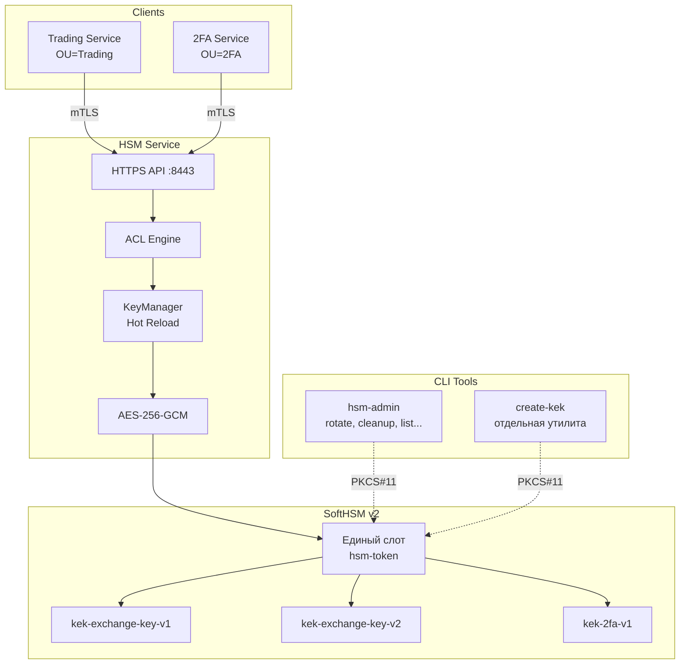
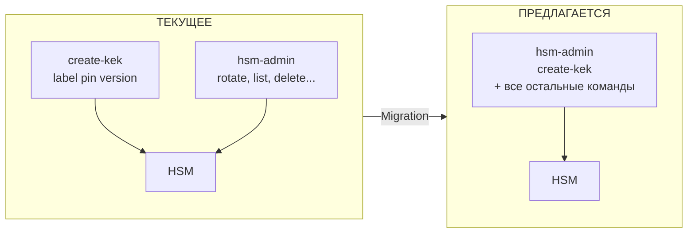
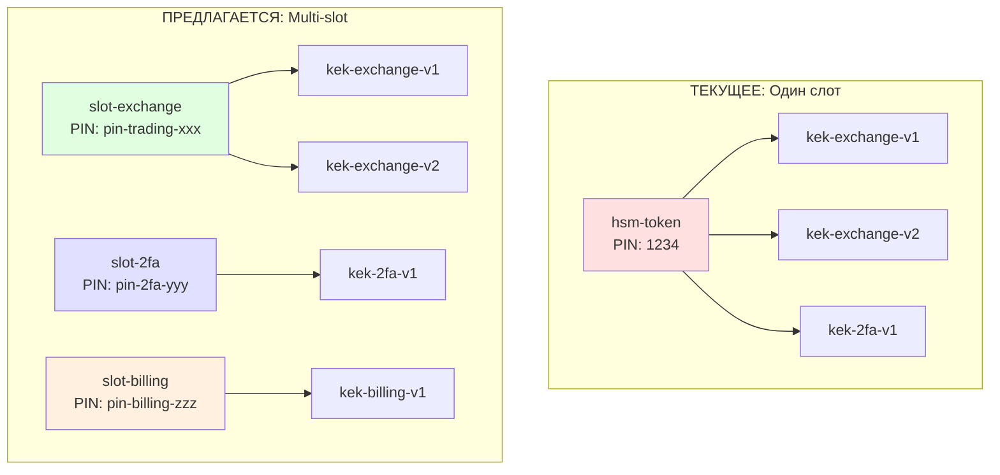
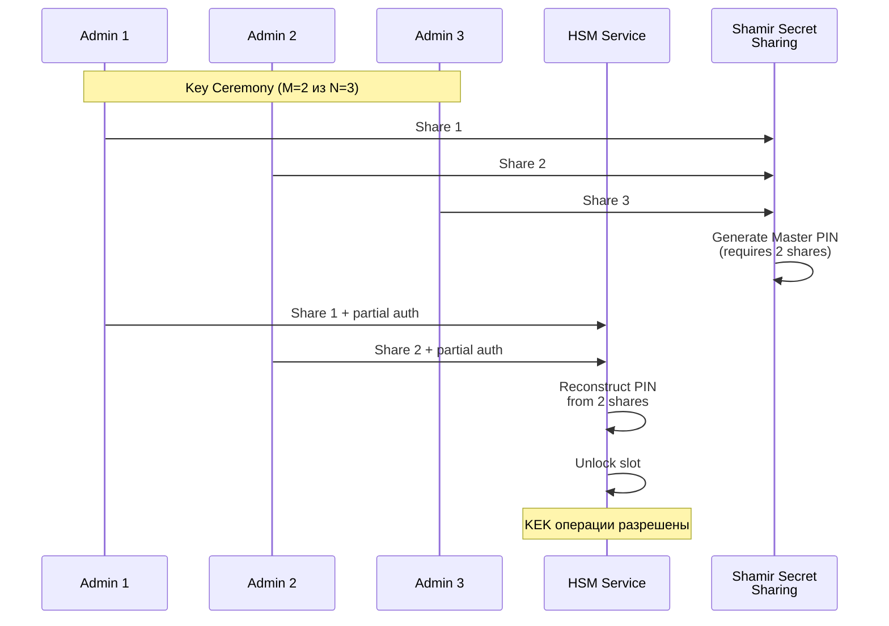
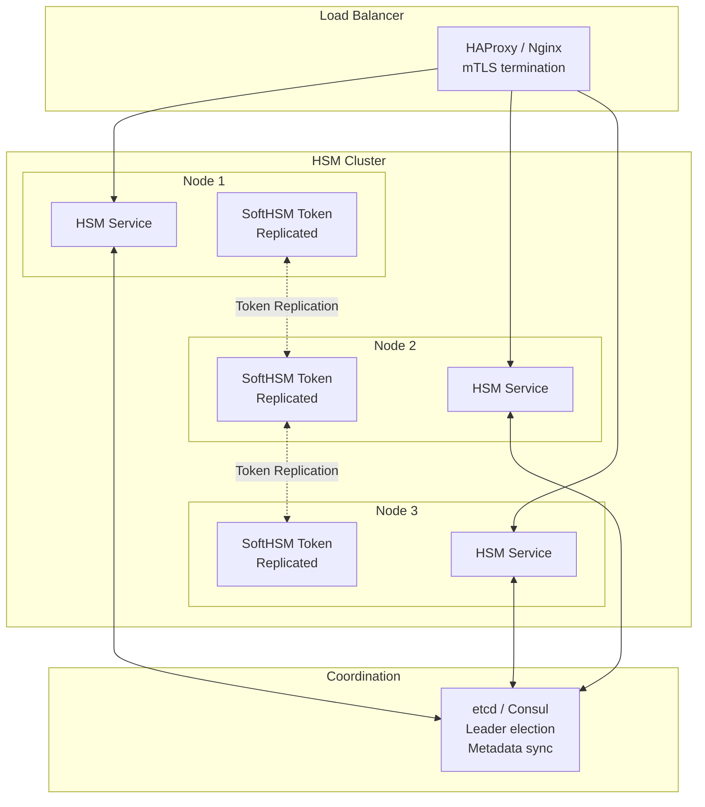
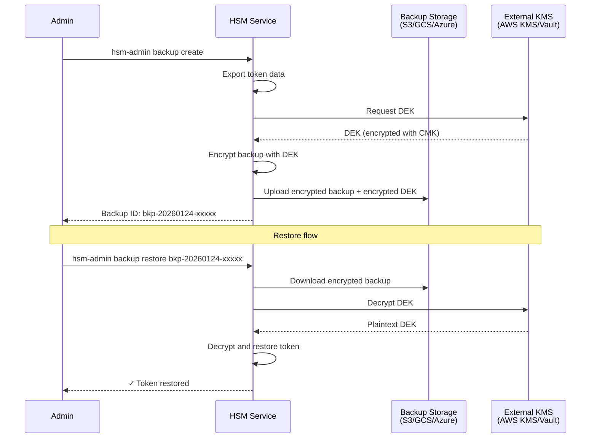
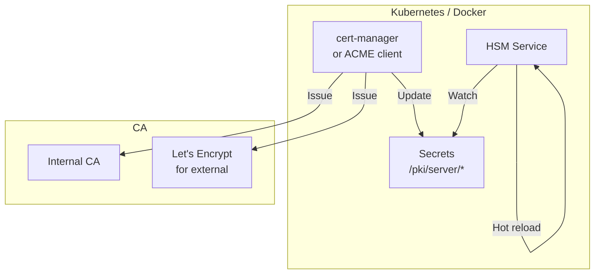

# 🚀 HSM Service — План дальнейшего развития

> **Версия**: 1.1  
> **Дата**: 24 января 2026  
> **Статус**: Draft for review

---

## 📋 Содержание

1. [Анализ текущего состояния](#анализ-текущего-состояния)
2. [Предложения пользователя](#предложения-пользователя)
3. [Дополнительные предложения](#дополнительные-предложения)
4. [Roadmap по приоритетам](#roadmap-по-приоритетам)
5. [Детальные спецификации](#детальные-спецификации)

---

## 🔍 Анализ текущего состояния

### Архитектура (текущая)



### Сильные стороны ✅

| Область | Реализация |
|---------|------------|
| **Безопасность** | mTLS, TLS 1.3, AES-256-GCM, KEK non-extractable |
| **Ротация ключей** | Zero-downtime hot reload, multi-version support |
| **PCI DSS** | 3.5.1, 3.6.1, 3.6.4, 3.7, 10.2, 10.3 — covered |
| **OWASP Top 10** | All 10 categories addressed |
| **Мониторинг** | Prometheus metrics, structured logging |
| **Тестирование** | Unit, integration, e2e, performance, compliance |

### Области для улучшения 🔧

| Область | Текущее состояние | Проблема |
|---------|-------------------|----------|
| **CLI утилиты** | 2 отдельных бинарника | Дублирование, сложность deployment |
| **Архитектура слотов** | Все KEK в одном слоте | Нет изоляции между контекстами |
| **High Availability** | Single instance | Нет clustering |
| **Key Escrow** | Отсутствует | Нет split knowledge |
| **Audit API** | Только логи | Нет API для аудита |
| **HSM Backup** | Ручной процесс | Нет encrypted backup |

---

## 👤 Предложения пользователя

### 1. Объединение create-kek в hsm-admin

**Текущее состояние:**
- `create-kek` — отдельный бинарник (~100 строк)
- `hsm-admin` — основной CLI (~470 строк)
- Дублирование PKCS#11 инициализации

**Проблемы:**
- Два бинарника для deployment
- Разный API (create-kek: позиционные args, hsm-admin: flags)
- Документация разбита



**Решение:**

```bash
# БЫЛО (два бинарника)
create-kek "kek-exchange-key-v1" "1234" 1
hsm-admin rotate exchange-key

# СТАНЕТ (единый CLI)
hsm-admin create-kek --label kek-exchange-key-v1 --context exchange-key --version 1
hsm-admin rotate exchange-key
```

**Изменения в коде:**

```go
// cmd/hsm-admin/main.go — добавить case
case "create-kek":
    createKEKCommand(args[1:])  // Перенести логику из cmd/create-kek/main.go

// Удалить cmd/create-kek/ после миграции
```

**Преимущества:**
- ✅ Единый бинарник для всех операций
- ✅ Консистентный API (все через flags)
- ✅ Проще deployment и документация
- ✅ Общая конфигурация через -config

**Миграция:**
1. Перенести код create-kek в hsm-admin
2. Обновить init-hsm.sh использовать `hsm-admin create-kek`
3. Deprecation notice для create-kek (1-2 релиза)
4. Удалить create-kek в v1.3.0

---

### 2. Размещение KEK в отдельных слотах

**Текущее состояние:**
- Все KEK в одном слоте `hsm-token`
- PIN един для всех ключей
- Нет изоляции между контекстами

**Проблемы:**
- Компрометация PIN = доступ ко ВСЕМ ключам
- Нет разделения обязанностей (Separation of Duties)
- Не соответствует PCI DSS 3.6.6 (split knowledge) при строгой интерпретации



**Архитектура Multi-Slot:**

```yaml
# config.yaml (новая структура)
hsm:
  pkcs11_lib: /usr/lib/softhsm/libsofthsm2.so
  # Убираем глобальный slot_id
  
  # Новая секция: слоты по контекстам
  slots:
    exchange:
      label: slot-exchange
      pin_env: HSM_PIN_EXCHANGE  # PIN из environment variable
      contexts:
        - exchange-key
    2fa:
      label: slot-2fa
      pin_env: HSM_PIN_2FA
      contexts:
        - 2fa
    billing:
      label: slot-billing
      pin_env: HSM_PIN_BILLING
      contexts:
        - billing
        - payments
```

**Изменения в коде:**

```go
// internal/hsm/multi_slot.go (новый файл)
type MultiSlotManager struct {
    slots map[string]*SlotContext  // context -> SlotContext
}

type SlotContext struct {
    ctx      *crypto11.Context
    slotName string
    keys     map[string]cipher.AEAD
}

func (m *MultiSlotManager) GetKeyForContext(context string) (cipher.AEAD, error) {
    slot, ok := m.slots[context]
    if !ok {
        return nil, fmt.Errorf("no slot configured for context: %s", context)
    }
    return slot.GetCurrentKey(context)
}
```

**Преимущества:**
- ✅ **Изоляция**: компрометация одного PIN не даёт доступ к другим ключам
- ✅ **Separation of Duties**: разные команды/роли — разные PIN'ы
- ✅ **PCI DSS 3.6.6**: split knowledge для критичных контекстов
- ✅ **Аудит**: отдельные логи по слотам
- ✅ **Гибкость**: можно использовать разные HSM для разных контекстов

**Обратная совместимость:**

```yaml
# Если slot_id указан глобально — работает как раньше (single slot)
hsm:
  slot_id: hsm-token  # Legacy mode
  
# Если указаны slots — multi-slot mode
hsm:
  slots:
    exchange:
      label: slot-exchange
      ...
```

---

## 💡 Дополнительные предложения

### 3. Key Escrow с Split Knowledge (PCI DSS 3.6.6)

**Проблема:**
- Единый администратор знает PIN и имеет полный доступ
- Нет защиты от insider threat
- PCI DSS 3.6.6 рекомендует split knowledge

**Решение: M-of-N Key Ceremony**



**Реализация:**

```yaml
# config.yaml
hsm:
  slots:
    production:
      label: slot-production
      # Split knowledge configuration
      key_ceremony:
        scheme: shamir      # Shamir Secret Sharing
        threshold: 2        # M - minimum shares needed
        total_shares: 3     # N - total shares
        share_holders:
          - name: "Security Officer 1"
            email: "so1@company.com"
          - name: "Security Officer 2"
            email: "so2@company.com"
          - name: "Security Officer 3"
            email: "so3@company.com"
```

**CLI для Key Ceremony:**

```bash
# Инициализация (генерация shares)
hsm-admin key-ceremony init --slot production --threshold 2 --shares 3
# Output: Share 1: xxxx-xxxx-xxxx (for SO1)
#         Share 2: yyyy-yyyy-yyyy (for SO2)
#         Share 3: zzzz-zzzz-zzzz (for SO3)

# Разблокировка (требует M shares)
hsm-admin key-ceremony unlock --slot production
# Enter share 1: xxxx-xxxx-xxxx
# Enter share 2: yyyy-yyyy-yyyy
# ✓ Slot unlocked
```

**Преимущества:**
- ✅ **PCI DSS 3.6.6**: полное соответствие split knowledge
- ✅ **Insider threat**: один человек не может получить доступ
- ✅ **Disaster recovery**: N-M shares могут быть утеряны
- ✅ **Audit trail**: кто участвовал в разблокировке

---

### 4. HSM Cluster Mode (High Availability)

**Проблема:**
- Single point of failure
- Нет горизонтального масштабирования
- Downtime при обновлениях

**Решение: Active-Active Cluster**



**Режимы работы:**

| Режим | Описание | Use Case |
|-------|----------|----------|
| **Standalone** | Текущий режим | Dev, small prod |
| **Active-Passive** | 1 active + N standby | Medium prod |
| **Active-Active** | All nodes serve traffic | High-load prod |

**Конфигурация:**

```yaml
# config.yaml
cluster:
  enabled: true
  mode: active-active
  node_id: hsm-node-1
  
  coordination:
    type: etcd
    endpoints:
      - etcd1.internal:2379
      - etcd2.internal:2379
      - etcd3.internal:2379
    
  token_replication:
    enabled: true
    interval_seconds: 60
    encryption_key_env: TOKEN_REPLICATION_KEY
```

**Преимущества:**
- ✅ **Zero downtime**: rolling updates
- ✅ **Масштабирование**: добавление нод без остановки
- ✅ **Disaster recovery**: автоматический failover
- ✅ **Load distribution**: распределение нагрузки

---

### 5. Audit API и Compliance Reports

**Проблема:**
- Аудит только через парсинг логов
- Нет API для compliance officers
- Нет готовых отчётов для PCI DSS аудита

**Решение: Audit API + Report Generator**

```mermaid
graph LR
    subgraph "HSM Service"
        API[/encrypt<br/>/decrypt]
        AUDIT[Audit Collector]
        DB[(Audit DB<br/>SQLite/PostgreSQL)]
    end

    subgraph "Audit API"
        QUERY[/audit/query]
        REPORT[/audit/reports]
        EXPORT[/audit/export]
    end

    subgraph "Reports"
        R1[PCI DSS 3.6.4<br/>Key Rotation]
        R2[PCI DSS 10.2<br/>Access Logs]
        R3[Custom Reports]
    end

    API --> AUDIT
    AUDIT --> DB
    DB --> QUERY
    DB --> REPORT
    DB --> EXPORT
    
    REPORT --> R1
    REPORT --> R2
    REPORT --> R3
```

**API Endpoints:**

```bash
# Query audit events
GET /audit/query?from=2026-01-01&to=2026-01-31&context=exchange-key&limit=1000

# Generate PCI DSS report
GET /audit/reports/pci-dss-3.6.4?period=90d

# Export for SIEM
GET /audit/export?format=json&from=2026-01-01
```

**Пример отчёта:**

```json
{
  "report_type": "PCI-DSS-3.6.4",
  "period": "2025-10-01 to 2026-01-01",
  "generated_at": "2026-01-24T10:00:00Z",
  "summary": {
    "total_contexts": 3,
    "rotations_required": 3,
    "rotations_completed": 3,
    "compliance_status": "COMPLIANT"
  },
  "details": [
    {
      "context": "exchange-key",
      "last_rotation": "2026-01-09T14:30:00Z",
      "rotation_interval_days": 90,
      "days_since_rotation": 15,
      "status": "OK"
    }
  ]
}
```

---

### 6. Encrypted HSM Backup (BYOK)

**Проблема:**
- Backup токенов — plaintext файлы
- Нет шифрования backup'ов
- Риск утечки при хранении/передаче

**Решение: Encrypted Backup with BYOK**



**Конфигурация:**

```yaml
# config.yaml
backup:
  enabled: true
  storage:
    type: s3
    bucket: hsm-backups-prod
    prefix: tokens/
    region: eu-central-1
  
  encryption:
    type: aws-kms          # aws-kms | vault | local
    key_id: alias/hsm-backup-key
    
  schedule:
    cron: "0 2 * * *"      # Daily at 02:00
    retention_days: 90
```

---

### 7. Certificate Auto-Renewal Integration

**Проблема:**
- Ручное обновление mTLS сертификатов
- Риск истечения и downtime
- Нет интеграции с cert-manager

**Решение: Auto-renewal + cert-manager**



**Реализация:**

```yaml
# config.yaml
server:
  tls:
    auto_reload: true
    check_interval_seconds: 60
    
    # Optional: cert-manager annotations
    cert_manager:
      enabled: true
      issuer: internal-ca-issuer
      duration: 90d
      renew_before: 30d
```

---

### 8. Web Admin UI (Optional)

**Проблема:**
- CLI only — порог входа для новых операторов
- Нет визуализации состояния ключей
- Нет графиков ротации

**Решение: Lightweight Admin Dashboard**

```mermaid
graph TB
    subgraph "Browser"
        UI[Admin UI<br/>React/Vue]
    end

    subgraph "HSM Service"
        API[REST API]
        ADMIN[/admin/*<br/>endpoints]
        AUTH[mTLS + RBAC]
    end

    UI -->|mTLS| AUTH
    AUTH --> ADMIN
    ADMIN --> API
```

**Features:**
- 📊 Dashboard с статусом ключей
- 🔄 Визуализация графика ротации
- 📋 Audit log viewer
- ⚙️ Configuration viewer (read-only)
- 🔐 mTLS аутентификация (тот же PKI)

**Примечание:** Это опциональная фича для удобства. CLI остаётся primary interface.

---

## 📅 Roadmap по приоритетам

### Phase 1: v1.1.0 (Q1 2026) — CLI Consolidation

| Task | Priority | Effort | Status |
|------|----------|--------|--------|
| Merge create-kek → hsm-admin | 🔴 High | 2d | TODO |
| Deprecation warnings | 🟡 Medium | 1d | TODO |
| Update documentation | 🟡 Medium | 1d | TODO |
| Update init-hsm.sh | 🟡 Medium | 0.5d | TODO |

### Phase 2: v1.2.0 (Q1 2026) — Multi-Slot Architecture

| Task | Priority | Effort | Status |
|------|----------|--------|--------|
| Design multi-slot config schema | 🔴 High | 1d | TODO |
| Implement MultiSlotManager | 🔴 High | 3d | TODO |
| Backward compatibility layer | 🔴 High | 1d | TODO |
| Migration guide | 🟡 Medium | 1d | TODO |
| Tests for multi-slot | 🟡 Medium | 2d | TODO |

### Phase 3: v1.3.0 (Q2 2026) — Security Enhancements

| Task | Priority | Effort | Status |
|------|----------|--------|--------|
| Shamir Secret Sharing for PINs | 🟠 Medium | 5d | TODO |
| Key Ceremony CLI | 🟠 Medium | 3d | TODO |
| Audit API (basic) | 🟡 Medium | 3d | TODO |
| Encrypted backup | 🟡 Medium | 4d | TODO |

### Phase 4: v1.4.0 (Q2-Q3 2026) — High Availability

| Task | Priority | Effort | Status |
|------|----------|--------|--------|
| Cluster mode design | 🟠 Medium | 2d | TODO |
| etcd integration | 🟠 Medium | 5d | TODO |
| Token replication | 🟠 Medium | 5d | TODO |
| Active-Active mode | 🟡 Low | 5d | TODO |

### Phase 5: v2.0.0 (Q4 2026) — Extended Features

| Task | Priority | Effort | Status |
|------|----------|--------|--------|
| Web Admin UI | 🟢 Low | 10d | TODO |
| cert-manager integration | 🟢 Low | 3d | TODO |
| Advanced audit reports | 🟢 Low | 5d | TODO |
| Hardware HSM support (Luna, Thales) | 🟢 Low | 10d | TODO |

---

## 📐 Детальные спецификации

### Spec 1: create-kek → hsm-admin Migration

**File changes:**

```
cmd/hsm-admin/main.go        # Add createKEKCommand()
cmd/hsm-admin/create_kek.go  # New file with logic from cmd/create-kek/main.go
cmd/create-kek/              # DEPRECATED, remove in v1.3.0
scripts/init-hsm.sh          # Update to use hsm-admin create-kek
CLI_TOOLS.md                 # Update documentation
```

**New CLI signature:**

```bash
hsm-admin create-kek \
  --label kek-exchange-key-v1 \
  --context exchange-key \
  --version 1 \
  --size 256
```

**Backward compatibility:**

```bash
# Old way (deprecated, shows warning)
create-kek "kek-exchange-key-v1" "1234" 1
# DEPRECATED: Use 'hsm-admin create-kek --label ...' instead

# New way
hsm-admin create-kek --label kek-exchange-key-v1 --context exchange-key
```

---

### Spec 2: Multi-Slot Architecture

**Config schema:**

```yaml
hsm:
  pkcs11_lib: /usr/lib/softhsm/libsofthsm2.so
  
  # Option A: Legacy single-slot (backward compatible)
  slot_id: hsm-token
  
  # Option B: Multi-slot (new)
  slots:
    trading:
      label: slot-trading
      pin_env: HSM_PIN_TRADING
      contexts:
        - exchange-key
        - order-key
    security:
      label: slot-security
      pin_env: HSM_PIN_SECURITY
      contexts:
        - 2fa
        - mfa
```

**Code structure:**

```go
// internal/hsm/slot_manager.go
type SlotManager interface {
    GetKeyForContext(context string) (cipher.AEAD, error)
    GetAllKeys() map[string][]string  // slot -> labels
    Close() error
}

// Single slot implementation (current)
type SingleSlotManager struct { ... }

// Multi-slot implementation (new)
type MultiSlotManager struct { ... }

// Factory function
func NewSlotManager(cfg *config.HSMConfig) (SlotManager, error) {
    if len(cfg.Slots) > 0 {
        return NewMultiSlotManager(cfg)
    }
    return NewSingleSlotManager(cfg)
}
```

---

## ✅ Критерии готовности

### Definition of Done для каждой фичи:

- [ ] Код написан и прошёл code review
- [ ] Unit tests (coverage > 80%)
- [ ] Integration tests
- [ ] Documentation обновлена
- [ ] CHANGELOG обновлён
- [ ] Backward compatibility проверена
- [ ] Security review пройден
- [ ] Performance не деградировала

---

## 📚 Ссылки

- [ARCHITECTURE.md](ARCHITECTURE.md) — текущая архитектура
- [SECURITY_AUDIT.md](SECURITY_AUDIT.md) — аудит безопасности
- [KEY_ROTATION.md](KEY_ROTATION.md) — процедуры ротации
- [CLI_TOOLS.md](CLI_TOOLS.md) — документация CLI
- [PCI DSS v4.0](https://www.pcisecuritystandards.org/) — стандарт

---

> **Next Steps:**
> 1. Review и approve этого плана
> 2. Создать issues/tasks в трекере
> 3. Начать с Phase 1 (CLI Consolidation)
