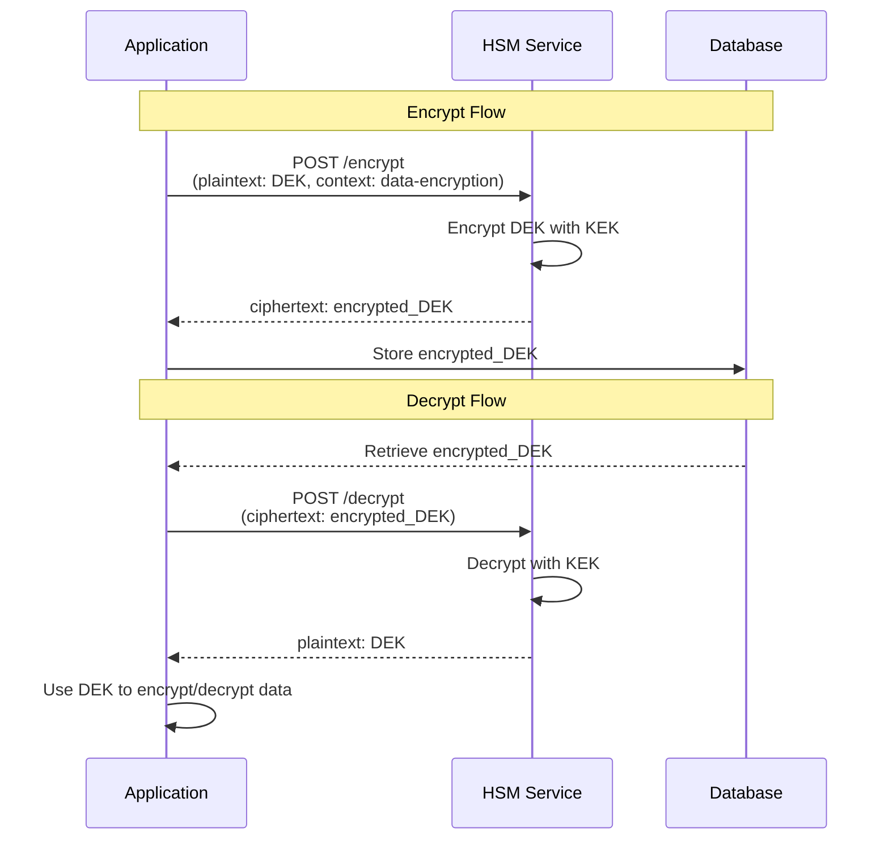
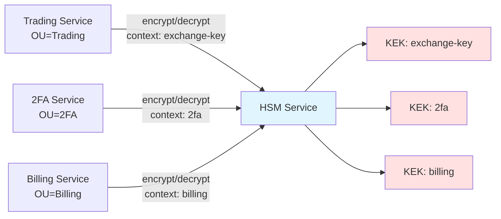
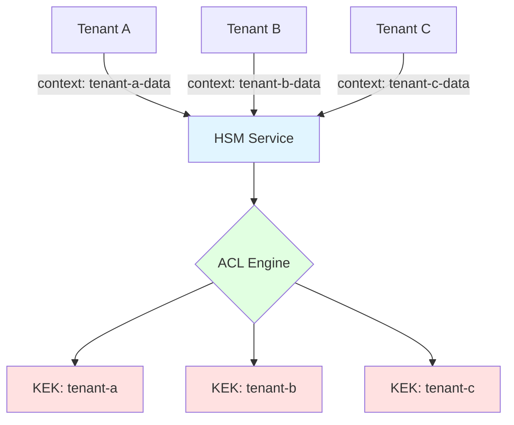
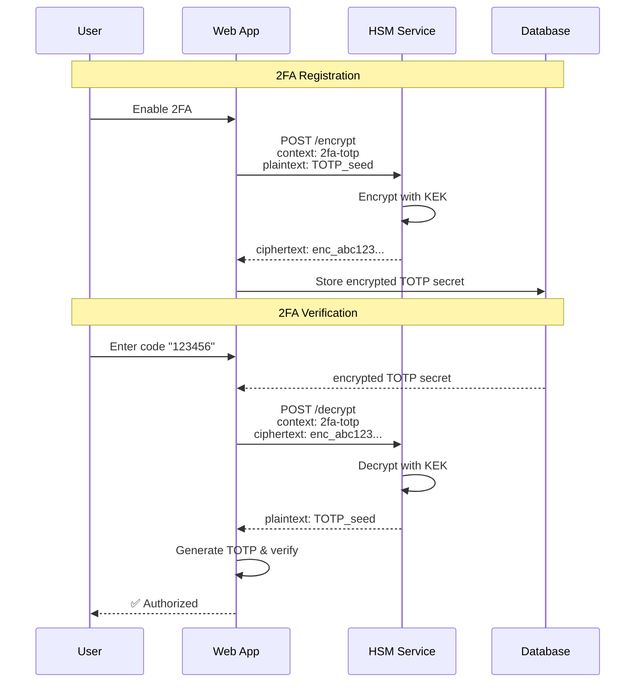
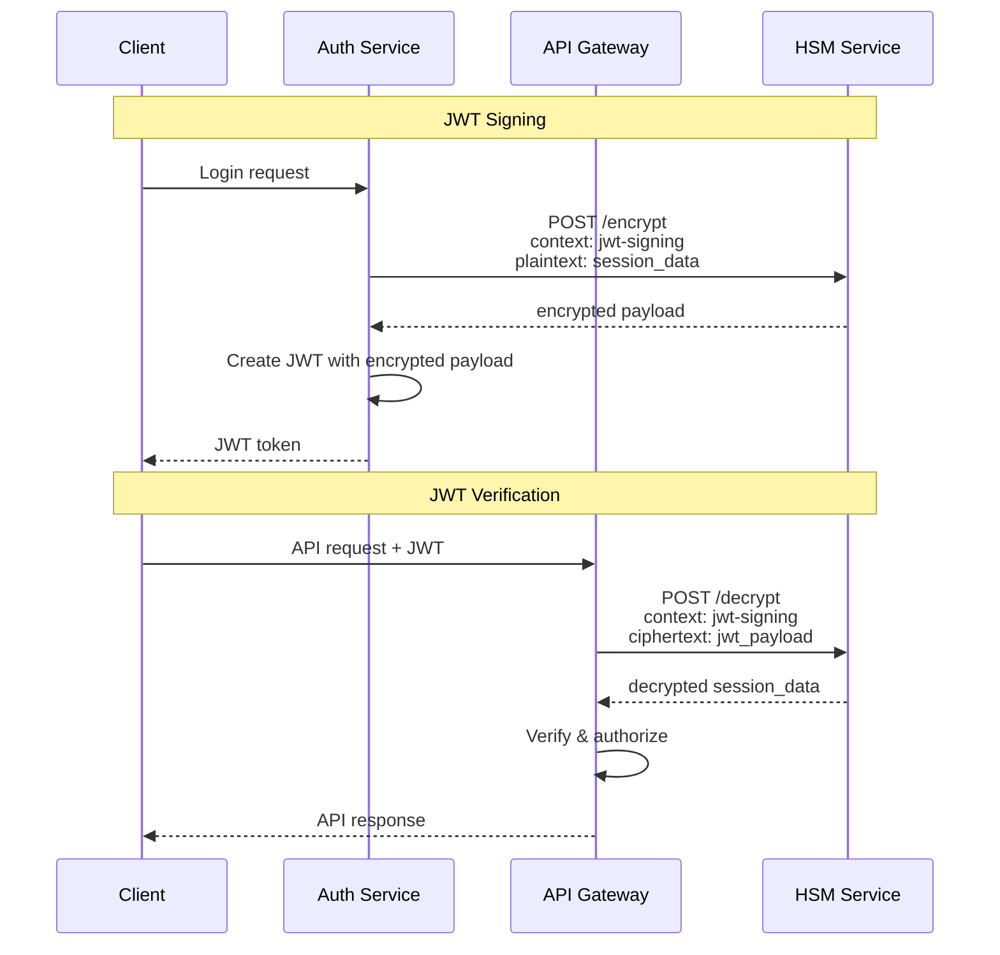
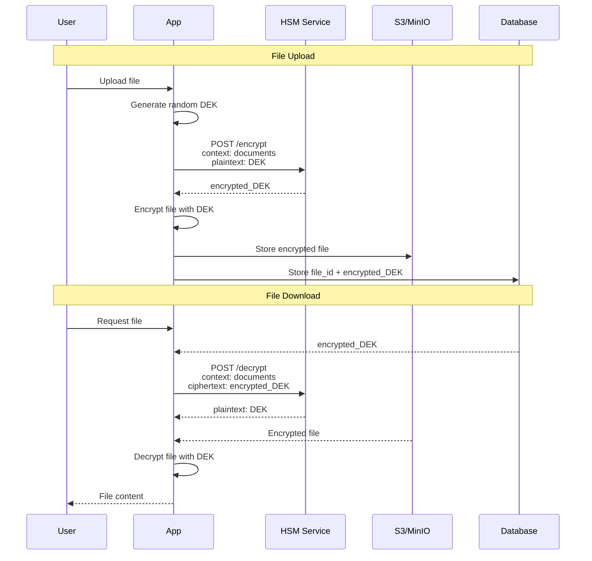
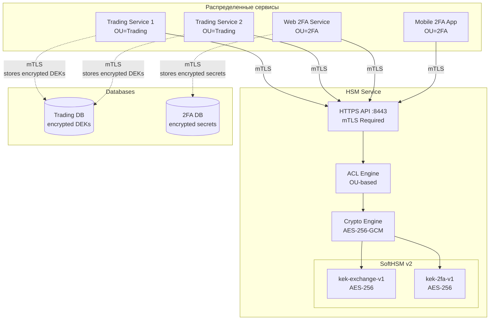

# 🔐 HSM Service - Centralized Cryptographic Key Management


Enterprise-grade HSM (Hardware Security Module) сервис для централизованного управления Key Encryption Keys (KEK) с поддержкой автоматической ротации, mTLS аутентификации и гранулярного контроля доступа.

---

## 💡 Зачем это нужно?

### Проблема: Ключи шифрования везде

В современных распределенных системах каждый микросервис часто хранит свои ключи шифрования локально:

❌ **Проблемы традиционного подхода:**
- Ключи в environment variables или config файлах
- Каждый сервис имеет копию KEK → высокий риск утечки
- Невозможность централизованной ротации ключей
- Нет аудита криптографических операций
- При компрометации одного сервиса → все данные под угрозой
- Сложность управления ключами в multi-service архитектуре

### Решение: Централизованный HSM Service

✅ **HSM Service обеспечивает:**
- **Zero trust**: KEK НИКОГДА не покидают HSM - только шифрование/расшифровка
- **Централизация**: Один источник истины для всех ключей
- **Простая ротация**: Ротация KEK без перезапуска микросервисов
- **Аудит**: Полное логирование всех криптографических операций
- **mTLS + ACL**: Гранулярный контроль доступа по Organizational Unit
- **High Availability**: Stateless архитектура для горизонтального масштабирования

### 🏦 PCI DSS Compliance

HSM Service покрывает критические требования:

#### Requirement 3: Защита хранимых данных держателей карт

- **3.5.1** - Криптографические ключи защищены от несанкционированного доступа
  - ✅ KEK хранятся в SoftHSM (PKCS#11 interface)
  - ✅ Ключи НИКОГДА не экспортируются за пределы HSM
  - ✅ mTLS для всех соединений (TLS 1.3, strong ciphers)

- **3.6.1** - Полная документация криптографических ключей
  - ✅ `pki/inventory.yaml` - реестр всех KEK с версиями
  - ✅ `pki/revoked.yaml` - история отозванных ключей
  - ✅ Каждый ключ привязан к context (назначение)
  - ✅ ACL определяет custodian для каждого context

- **3.6.4** - Ротация ключей минимум раз в год (рекомендация: 90 дней)
  - ✅ **Автоматическая ротация каждые 90 дней**
  - ✅ Zero-downtime: старый KEK сохраняется для расшифровки
  - ✅ Плавный переход: новые данные шифруются новым KEK
  - ✅ Механизм re-encryption для миграции данных

- **3.7** - Минимизация доступа к ключам
  - ✅ Только HSM Service имеет доступ к KEK
  - ✅ ACL на уровне Organizational Unit (OU)
  - ✅ Context isolation (Trading не видит 2FA ключи)

#### Requirement 10: Журналирование и мониторинг

- **10.2.2** - Логирование всех действий привилегированных пользователей
  - ✅ Каждый encrypt/decrypt логируется с timestamp
  - ✅ Логи включают: client CN, OU, context, KEK alias
  - ✅ Интеграция с SIEM (Splunk, ELK, Grafana Loki)

- **10.3** - Audit trail для всех событий с ключами
  - ✅ Логи операций: encrypt, decrypt, rotate, revoke
  - ✅ Невозможность удаления/модификации логов
  - ✅ Retention policy: минимум 1 год (настраивается)

---

## 🎯 Где применять?

### Use Case 1: Защита данных в базах данных

**Проблема**: Нужно хранить sensitive данные (PII, платежные данные, пароли) в БД

**Решение**:



**Применимо для**:
- E-commerce платформы (платежные данные)
- Healthcare системы (медицинские записи, HIPAA compliance)
- Banking приложения (транзакции, PCI DSS compliance)
- SaaS платформы (данные клиентов, GDPR compliance)

---

### Use Case 2: Microservices Architecture

**Проблема**: 50+ микросервисов, у каждого свои ключи для inter-service communication

**Решение**: Централизованное управление ключами через HSM Service



**Преимущества**:
- Единая точка управления ключами для всех сервисов
- Автоматическая ротация без downtime
- Изоляция по contexts (каждый сервис видит только свои ключи)
- Аудит всех операций

---

### Use Case 3: Secrets Management

**Проблема**: Хранение secrets (API keys, tokens, credentials) в Vault/env vars

**Решение**: Шифрование secrets через HSM Service перед сохранением


**Применимо для**:
- CI/CD pipelines (credentials для deployment)
- API key management
- OAuth tokens хранение
- Database credentials rotation

---

### Use Case 4: Compliance (PCI DSS, GDPR, HIPAA)

**Проблема**: Регуляторы требуют ротацию ключей, аудит доступа, secure key storage

**HSM Service из коробки**:
- ✅ **PCI DSS Requirement 3.6.4**: Ротация KEK каждые 90 дней (автоматическая)
- ✅ **PCI DSS Requirement 3.5**: Защита ключей от unauthorized access (mTLS + ACL)
- ✅ **PCI DSS Requirement 3.6.1**: Full documentation ключей (inventory.yaml)
- ✅ **PCI DSS Requirement 3.7**: Минимизация доступа к ключам (ACL по OU)
- ✅ **PCI DSS Requirement 10.2**: Audit trail всех криптографических операций
- ✅ **GDPR Article 32**: Encryption of personal data
- ✅ **HIPAA**: Encryption and key management controls

#### 📋 Детальное соответствие PCI DSS v4.0

| Requirement | Описание | Реализация в HSM Service |
|------------|----------|--------------------------|
| **3.5.1** | Cryptographic keys secured against disclosure | KEK хранятся в SoftHSM (PKCS#11), никогда не экспортируются |
| **3.6.1.1** | Cryptographic keys documented | `pki/inventory.yaml` - полный реестр KEK с версиями |
| **3.6.1.2** | Key usage documented | Каждый KEK привязан к context (exchange, 2fa, billing) |
| **3.6.1.3** | Key custodian defined | ACL определяет, кто может использовать каждый context |
| **3.6.4** | Key rotation every 90 days | Автоматическая ротация через `POST /rotate/:context` |
| **3.7.1** | Minimize locations with keys | Только HSM Service имеет доступ к KEK |
| **3.7.2** | Minimum access to keys | ACL на уровне OU + context изоляция |
| **10.2.2** | All actions by privileged users | Логирование всех encrypt/decrypt операций |
| **10.3** | Audit trail for key events | Timestamps + client CN + context в логах |
| **12.3.2** | Cryptographic architecture documented | `ARCHITECTURE.md`, `API.md` |

**Пример audit log для PCI DSS 10.2**:
```json
{
  "timestamp": "2026-01-10T15:30:45Z",
  "client_cn": "trading-service-1.ct-system.local",
  "client_ou": "Trading",
  "operation": "encrypt",
  "context": "exchange-key",
  "kek_alias": "kek-exchange-v2",
  "status": "success",
  "request_id": "req-abc123"
}
```

**Для PCI DSS audit**: экспортируйте логи в SIEM (Splunk/ELK), настройте алерты на unauthorized access attempts.

---

### Use Case 5: Multi-Tenant SaaS

**Проблема**: Каждый tenant требует изоляции данных

**Решение**: Dedicated context для каждого tenant



**ACL гарантирует**: Tenant A не может расшифровать данные Tenant B

---

### Use Case 6: 2FA/MFA Token Protection

**Проблема**: Секреты для TOTP/HOTP (Google Authenticator, Authy) хранятся в БД в открытом виде

**Риски**:
- При утечке БД злоумышленник получает все TOTP seeds
- Может генерировать валидные 2FA коды для ВСЕХ пользователей
- Обход двухфакторной аутентификации

**Решение через HSM Service**:



**Защита**:
- ✅ TOTP secrets НИКОГДА не хранятся в открытом виде
- ✅ При компрометации БД → все secrets зашифрованы
- ✅ Ротация KEK → re-encrypt всех 2FA secrets без action от пользователей
- ✅ ACL изоляция: только сервисы с OU=2FA могут расшифровать

**Применимо для**:
- Banking apps (мобильное приложение банка)
- Corporate SSO (Okta, Azure AD)
- Crypto exchanges (защита аккаунтов)
- Admin panels (защита privileged доступа)

---

### Use Case 7: JWT Token Signing Keys

**Проблема**: Private keys для подписи JWT токенов хранятся в файлах/env vars

**Решение**: Централизованное хранение signing keys в HSM



**Преимущества**:
- ✅ Private key для JWT НИКОГДА не покидает HSM
- ✅ Ротация signing key без invalidation старых токенов
- ✅ Multi-version support (v1, v2, v3 ключей одновременно)
- ✅ Аудит: кто и когда подписал/проверил токен

---

### Use Case 8: File Encryption (Document Management)

**Проблема**: Загруженные файлы (паспорта, договоры, медкарты) в S3/MinIO в открытом виде

**Решение**: Client-side encryption через HSM Service



**Use cases**:
- 📄 Legal tech (договоры, NDA)
- 🏥 Healthcare (медицинские карты, HIPAA)
- 🏦 Banking (документы KYC)
- 📋 HR системы (резюме, персональные данные)

---

### Use Case 9: Database Column Encryption (Transparent)

**Проблема**: Миграция существующей БД на шифрование без изменения application code

**Решение**: Database triggers + HSM Service

```sql
-- PostgreSQL trigger для автоматического шифрования
CREATE TRIGGER encrypt_pii
  BEFORE INSERT OR UPDATE ON users
  FOR EACH ROW
  EXECUTE FUNCTION encrypt_via_hsm(NEW.email, NEW.phone);

-- Function вызывает HSM API
CREATE FUNCTION encrypt_via_hsm(email TEXT, phone TEXT)
  RETURNS TRIGGER AS $$
  BEGIN
    NEW.email = http_post('https://hsm:8443/encrypt', 
      json_build_object('plaintext', email, 'context', 'user-pii'));
    NEW.phone = http_post('https://hsm:8443/encrypt',
      json_build_object('plaintext', phone, 'context', 'user-pii'));
    RETURN NEW;
  END;
$$ LANGUAGE plpgsql;
```

**Преимущества**:
- ✅ Zero application code changes
- ✅ Transparent encryption/decryption
- ✅ Централизованная ротация ключей
- ✅ Поддержка legacy систем

---

## 🏗️ Архитектура

> **📖 Полная документация**: См. [ARCHITECTURE.md](ARCHITECTURE.md) для детального технического описания, компонентов и data flow

### Контекст использования



**Ключевые принципы**:
- 🔒 KEK никогда не покидают HSM
- 🔐 Все соединения - mTLS (clients ↔ HSM, services ↔ DB)
- 🎯 ACL изолирует contexts по Organizational Unit
- 🔄 Zero-downtime ротация ключей
- 📊 Полный аудит всех операций

### Разделение конфигурации

Сервис использует двухфайловую архитектуру конфигурации для совместимости с GitOps/IaC:

**config.yaml** (статическая конфигурация, в Git)
- Типы ключей и политики ротации
- ACL правила и маппинг OU → contexts
- Настройки сервера и HSM
- Монтируется read-only (`:ro`)

**metadata.yaml** (динамические метаданные, вне Git)
- **Текущая активная версия** (`current`) для каждого контекста
- **Массив всех версий** (`versions`) - поддержка overlap period
- Временные метки создания и номера версий
- Обновляется автоматически при ротации
- Монтируется read-write (`:rw`)

Пример структуры metadata.yaml:
```yaml
rotation:
  exchange-key:
    current: kek-exchange-v2      # Активная версия для новых операций
    versions:
      - label: kek-exchange-v1    # Старая версия (для расшифровки)
        version: 1
        created_at: '2026-01-09T00:00:00Z'
      - label: kek-exchange-v2    # Новая версия
        version: 2
        created_at: '2026-01-16T10:30:00Z'
```

Это обеспечивает:
- ✅ **GitOps совместимость** (Ansible/Terraform не конфликтует с автоматической ротацией)
- ✅ **Immutable Infrastructure** (config.yaml read-only)
- ✅ **Key Overlap Period** (множественные версии ключей доступны одновременно)
- ✅ **Zero-downtime rotation** (старые данные расшифровываются v1, новые шифруются v2)
- ✅ **Простой rollback** (изменяется только metadata.yaml)

---

## 🔑 Управление ключами

**Подробная информация** → см. [PKI_SETUP.md](PKI_SETUP.md) для настройки PKI и [QUICKSTART_DOCKER.md](QUICKSTART_DOCKER.md) / [QUICKSTART_NATIVE.md](QUICKSTART_NATIVE.md) для первого запуска

### Проверка статуса ротации

```bash
docker exec hsm-service /app/hsm-admin rotation-status
```

### Ротация ключа

```bash
# 1. Проверить что ключи готовы к ротации
docker exec hsm-service /app/hsm-admin rotation-status

# 2. Выполнить ротацию (создаёт новую версию ключа)
docker exec hsm-service /app/hsm-admin rotate exchange-key

# 3. Перезапустить сервис для загрузки новой версии
docker restart hsm-service

# 4. Проверить что обе версии доступны
docker exec hsm-service /app/hsm-admin rotation-status

# 5. Очистить старые версии (опционально, через 30+ дней)
docker exec hsm-service /app/hsm-admin cleanup-old-versions --dry-run
docker exec hsm-service /app/hsm-admin cleanup-old-versions
```

**Важно:**
- После ротации доступны **обе версии** ключа (overlap period)
- Новые операции encrypt используют v2
- Старые данные можно расшифровать ключом v1
- Автоматический cleanup удалит версии старше 30 дней (или при превышении max_versions=3)
- Используйте `--dry-run` для предварительного просмотра

## 🛡️ Безопасность

### ACL Маппинг

| Organizational Unit | Разрешенные Contexts |
|---------------------|---------------------|
| Trading             | exchange-key        |
| 2FA                 | 2fa                 |
| Database            | (нет доступа)       |

### Требования к клиентским сертификатам

- Должны быть выданы доверенным CA (указан в `config.yaml`)
- CN должен быть уникальным
- OU должен быть определен в ACL маппинге
- Сертификат не должен быть отозван (проверка по `revoked.yaml`)

### Certificate Revocation (Отзыв сертификатов)

**Автоматическая перезагрузка списка отзыва:**
- ✅ HSM Service автоматически перезагружает `revoked.yaml` **каждые 30 секунд** без перезапуска
- ✅ Проверка файла только при изменении (по modTime) - минимальная нагрузка
- ✅ Валидация перед применением: битый YAML не загружается, старые данные сохраняются
- ✅ Atomic update: либо все записи применяются, либо ни одна
- ✅ Thread-safe: concurrent reads во время reload

**Формат revoked.yaml:**
```yaml
revoked:
  - cn: "client1.example.com"
    serial: "1A:2B:3C:4D"
    reason: "key-compromise"
    date: "2024-01-15"
  
  - cn: "old-service.example.com"
    serial: "5E:6F:7A:8B"
    reason: "cessation-of-operation"
    date: "2024-02-01"
```

**Отзыв сертификата:**
```bash
# Автоматически добавляет в revoked.yaml
cd pki
./scripts/revoke-cert.sh client1.example.com "key-compromise"

# Изменения применятся автоматически в течение 30 секунд
# Клиент client1.example.com получит 403 Forbidden
```

**Защита от ошибок:**
- Пустые CN отклоняются
- Дубликаты CN обнаруживаются  
- Невалидный YAML не применяется
- При удалении файла список очищается (никто не блокируется)

### TLS/Transport Security

**TLS 1.3 ONLY** - Намеренное решение безопасности:
- ✅ **Обязательное требование:** Все клиенты ДОЛЖНЫ поддерживать TLS 1.3
- ✅ **Нет fallback на TLS 1.2** - устаревшие протоколы отключены
- ✅ **Причины:**
  - TLS 1.3 убирает слабые алгоритмы (RC4, 3DES, MD5, SHA-1)
  - Обязательная Perfect Forward Secrecy (PFS)
  - Шифрование handshake (защита метаданных)
  - Упрощенная конфигурация cipher suites
  - PCI DSS 4.0 настоятельно рекомендует TLS 1.3+
- ✅ **Совместимость:** Все современные клиенты поддерживают TLS 1.3 с 2018 года
  - Go 1.13+ (2019)
  - OpenSSL 1.1.1+ (2018)
  - Python 3.7+ (2018)
  - Node.js 12+ (2019)
  - Java 11+ (2018)
  - Все современные браузеры

**Cipher Suites (только TLS 1.3):**
- `TLS_AES_256_GCM_SHA384` - основной (AES-256-GCM)
- `TLS_CHACHA20_POLY1305_SHA256` - для mobile/ARM оптимизация

**Mutual TLS (mTLS):**
- Обязательная клиентская аутентификация через сертификаты
- Проверка цепочки сертификатов до доверенного CA
- Валидация CN и OU клиента

### Ротация ключей

- **Интервал по умолчанию:** 90 дней (PCI DSS Requirement 3.6.4)
- **Период перекрытия (overlap):** Безлимитный - все версии ключей доступны одновременно
- **Retention Policy:** 
  - Max версий: 3 (настраивается через `max_versions`)
  - Auto-cleanup: версии старше 30 дней (настраивается через `cleanup_after_days`)
  - PCI DSS compliant - автоматическая очистка устаревших ключей
- **Версионирование:** kek-exchange-v1 → kek-exchange-v2 → kek-exchange-v3...
- **Динамические ID:** Каждая версия получает уникальный 16-значный hex ID на основе timestamp
- **Zero-downtime:** Старые данные расшифровываются v1, новые шифруются v2
- **Автоматические проверки:** При старте сервиса проверяются просроченные ключи и избыточные версии

## 🔧 Конфигурация

### config.yaml

```yaml
hsm:
  pkcs11_lib: /usr/lib/softhsm/libsofthsm2.so
  slot_id: hsm-token
  metadata_file: /app/metadata.yaml
  max_versions: 3           # Maximum key versions to keep (PCI DSS)
  cleanup_after_days: 30    # Auto-delete versions older than N days
  keys:
    exchange-key:
      type: aes
    2fa:
      type: aes

acl:
  revoked_file: /app/pki/revoked.yaml
  mappings:
    Trading: [exchange-key]
    2FA: [2fa]
```

**Rotation policy** настраивается в `metadata.yaml`:
```yaml
rotation:
  exchange-key:
    rotation_interval_days: 90  # PCI DSS compliant
    current: kek-exchange-v1
    versions: [...]
```

### metadata.yaml

```yaml
rotation:
  exchange-key:
    current: kek-exchange-v2     # Текущая активная версия
    versions:
      - label: kek-exchange-v1   # Старая версия (доступна для decrypt)
        version: 1
        created_at: '2026-01-09T00:00:00Z'
      - label: kek-exchange-v2   # Новая версия (используется для encrypt)
        version: 2
        created_at: '2026-01-16T10:30:00Z'
  
  2fa:
    current: kek-2fa-v1
    versions:
      - label: kek-2fa-v1
        version: 1
        created_at: '2026-01-09T00:00:00Z'
```

### Environment Variables

```bash
# Обязательно
HSM_PIN=1234              # PIN для доступа к HSM токену

# Опционально
CONFIG_PATH=/app/config.yaml
LOG_LEVEL=info
```

## 📊 Мониторинг

### Health Check

```bash
curl https://hsm-service.local:8443/health
```

**Response:**
```json
{
  "status": "healthy",
  "hsm_initialized": true,
  "active_keys": 2,
  "timestamp": "2025-01-10T10:30:00Z"
}
```

### Метрики (если включено)

- `hsm_encrypt_total` - Количество операций encrypt
- `hsm_decrypt_total` - Количество операций decrypt
- `hsm_encrypt_duration_seconds` - Latency encrypt операций
- `hsm_decrypt_duration_seconds` - Latency decrypt операций
- `hsm_acl_denied_total` - Количество отказов ACL

## 🐳 Docker Compose

```yaml
services:
  hsm-service:
    build: .
    ports:
      - "8443:8443"
    environment:
      - HSM_PIN=${HSM_PIN}
    volumes:
      - ./config.yaml:/app/config.yaml:ro          # Статическая конфигурация
      - ./metadata.yaml:/app/metadata.yaml:rw      # Динамические метаданные
      - ./pki:/app/pki:ro                          # PKI certificates
      - ./data/tokens:/var/lib/softhsm/tokens      # HSM storage
    restart: unless-stopped
```

## 🧪 Тестирование

```bash
# Unit tests
go test ./internal/...

# Integration tests
./tests/integration/full-integration-test.sh
```

---

## 📚 Документация

**Начните здесь**: [DOCS_INDEX.md](DOCS_INDEX.md) - Полный индекс всей документации с порядком чтения

### 🚀 Начало работы

| Документ | Описание | Время |
|----------|----------|-------|
| [PKI_SETUP.md](PKI_SETUP.md) | Настройка PKI (CA, сертификаты) | 15 мин |
| [QUICKSTART_DOCKER.md](QUICKSTART_DOCKER.md) | Быстрый старт (Docker) | 5 мин |
| [QUICKSTART_NATIVE.md](QUICKSTART_NATIVE.md) | Быстрый старт (Native Go binary) | 10 мин |

### 🏗️ Архитектура и спецификации

| Документ | Описание | Время |
|----------|----------|-------|
| [ARCHITECTURE.md](ARCHITECTURE.md) | Детальная архитектура системы | 20 мин |
| [TECHNICAL_SPEC.md](TECHNICAL_SPEC.md) | Техническая спецификация | 30 мин |
| [API.md](API.md) | Полная документация REST API | 15 мин |

### 🔧 Разработка и развертывание

| Документ | Описание | Время |
|----------|----------|-------|
| [DOCKER.md](DOCKER.md) | Docker конфигурация | 10 мин |
| [DOCKER_COMPOSE.md](DOCKER_COMPOSE.md) | Docker Compose setup | 10 мин |
| [DOCKER_DEV.md](DOCKER_DEV.md) | Development в Docker | 10 мин |
| [PRODUCTION_DEBIAN.md](PRODUCTION_DEBIAN.md) | Production на Debian 13 + nftables | 30 мин |

### 🔑 Управление ключами и сертификатами

| Документ | Описание | Время |
|----------|----------|-------|
| [KEY_ROTATION.md](KEY_ROTATION.md) | Процедуры ротации ключей | 15 мин |
| [pki/README.md](pki/README.md) | Управление PKI и отзыв сертификатов | 15 мин |

### 🛠️ Инструменты и CLI

| Документ | Описание | Время |
|----------|----------|-------|
| [CLI_TOOLS.md](CLI_TOOLS.md) | hsm-admin command reference | 10 мин |
| [scripts/README.md](scripts/README.md) | Скрипты автоматизации | 10 мин |

### 📊 Мониторинг и troubleshooting

| Документ | Описание | Время |
|----------|----------|-------|
| [MONITORING.md](MONITORING.md) | Prometheus + Grafana | 15 мин |
| [TROUBLESHOOTING.md](TROUBLESHOOTING.md) | Решение проблем и FAQ | 15 мин |

### 💾 Backup и тестирование

| Документ | Описание | Время |
|----------|----------|-------|
| [BACKUP_RESTORE.md](BACKUP_RESTORE.md) | Backup и DR | 10 мин |
| [TESTING_GUIDE.md](TESTING_GUIDE.md) | Руководство по тестированию | 20 мин |
| [EXTREME_TEST_RESULTS.md](EXTREME_TEST_RESULTS.md) | Результаты нагрузочного тестирования | 15 мин |

**Всего 20 документов**, ~15,000 строк, полное покрытие от quick start до production deployment.

---

## 📝 Логирование

Все криптографические операции логируются:

```json
{
  "level": "info",
  "time": "2025-01-10T10:30:00Z",
  "msg": "Encrypt operation",
  "client_cn": "hsm-trading-client-1",
  "client_ou": "Trading",
  "context": "exchange-key",
  "key_id": "kek-exchange-v2",
  "operation": "encrypt",
  "duration_ms": 12
}
```

## 🤝 Поддержка

- Email: titaev@gmail.com

## 📄 Лицензия

См. [LICENSE](LICENSE)

## 🔗 Полезные ссылки

- [PKCS#11 Specification](http://docs.oasis-open.org/pkcs11/pkcs11-base/v2.40/pkcs11-base-v2.40.html)
- [PCI DSS Requirements](https://www.pcisecuritystandards.org/)
- [SoftHSM Documentation](https://www.opendnssec.org/softhsm/)
