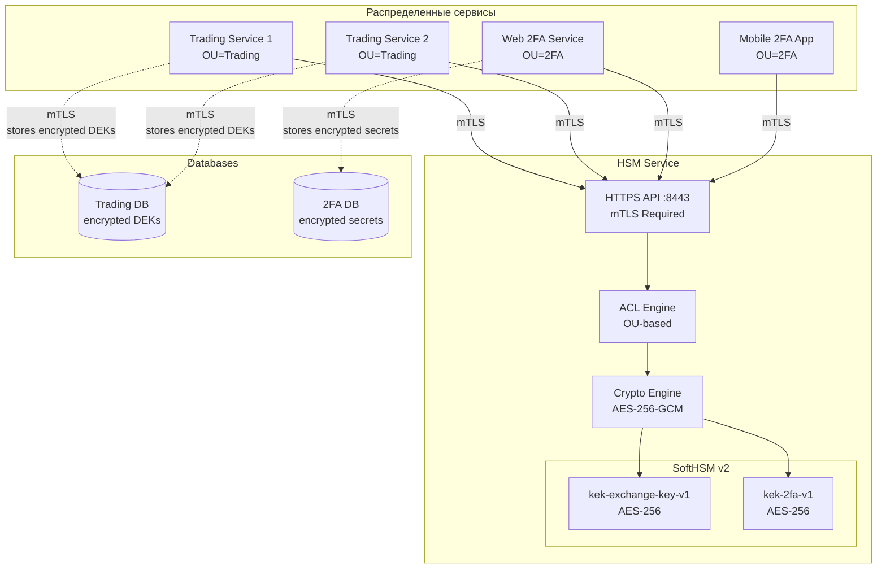
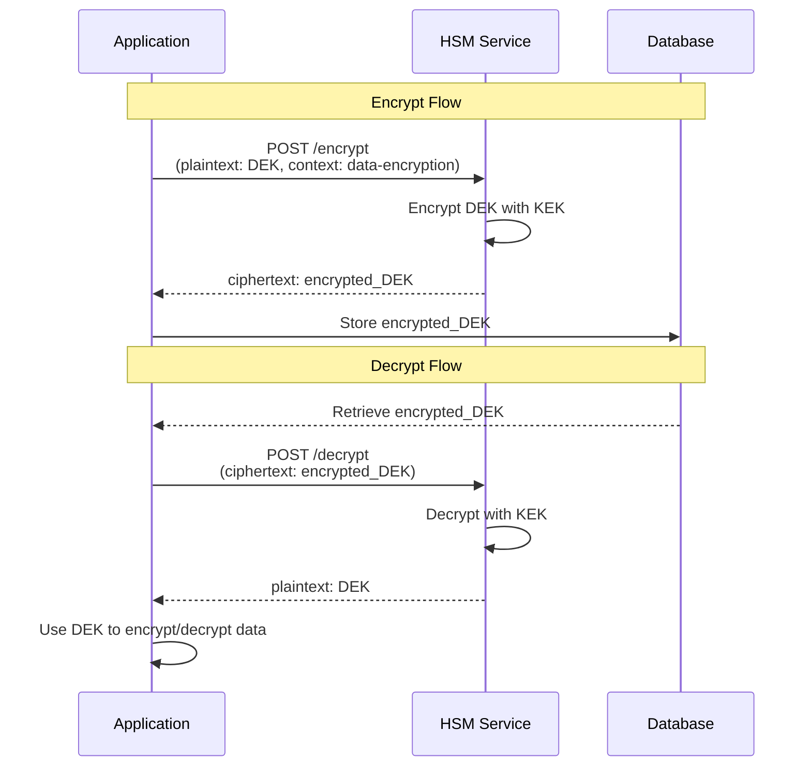
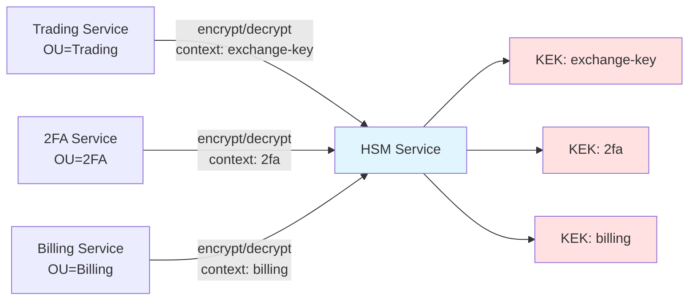
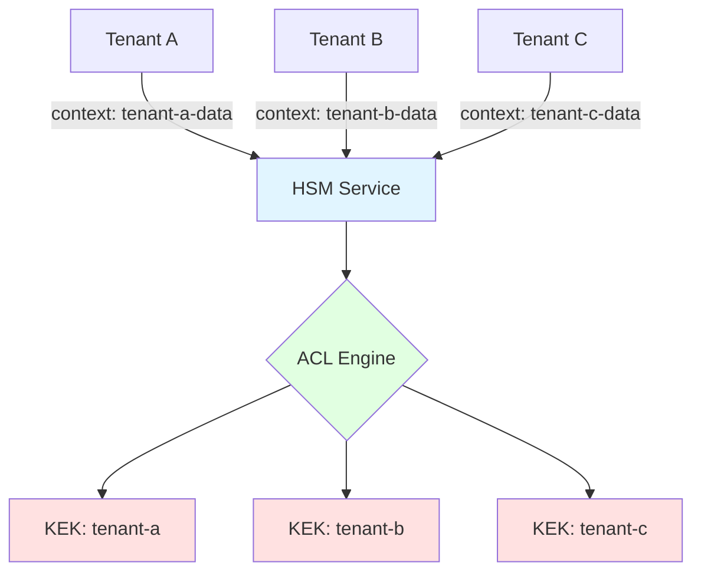
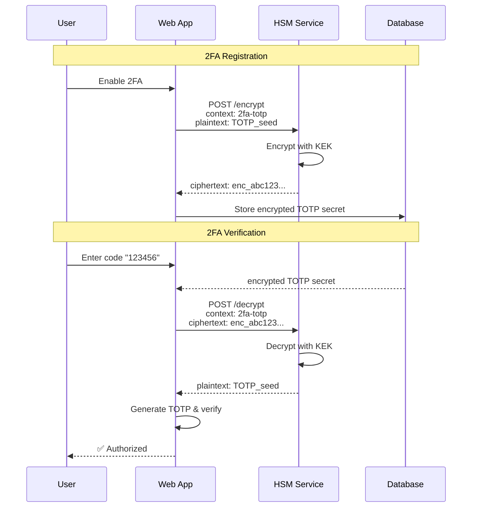
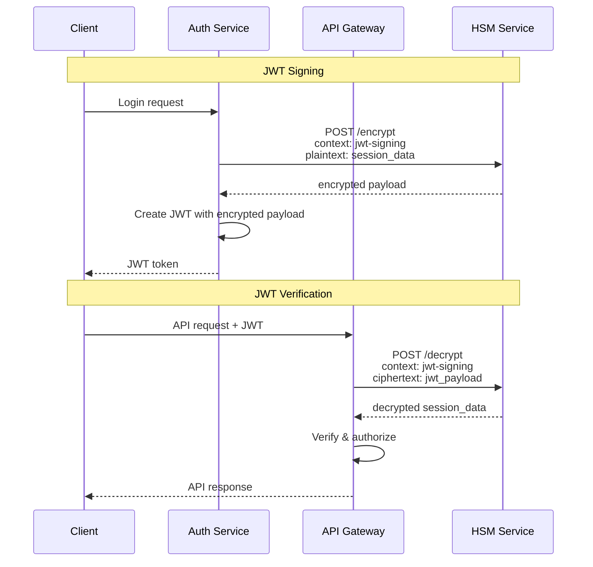
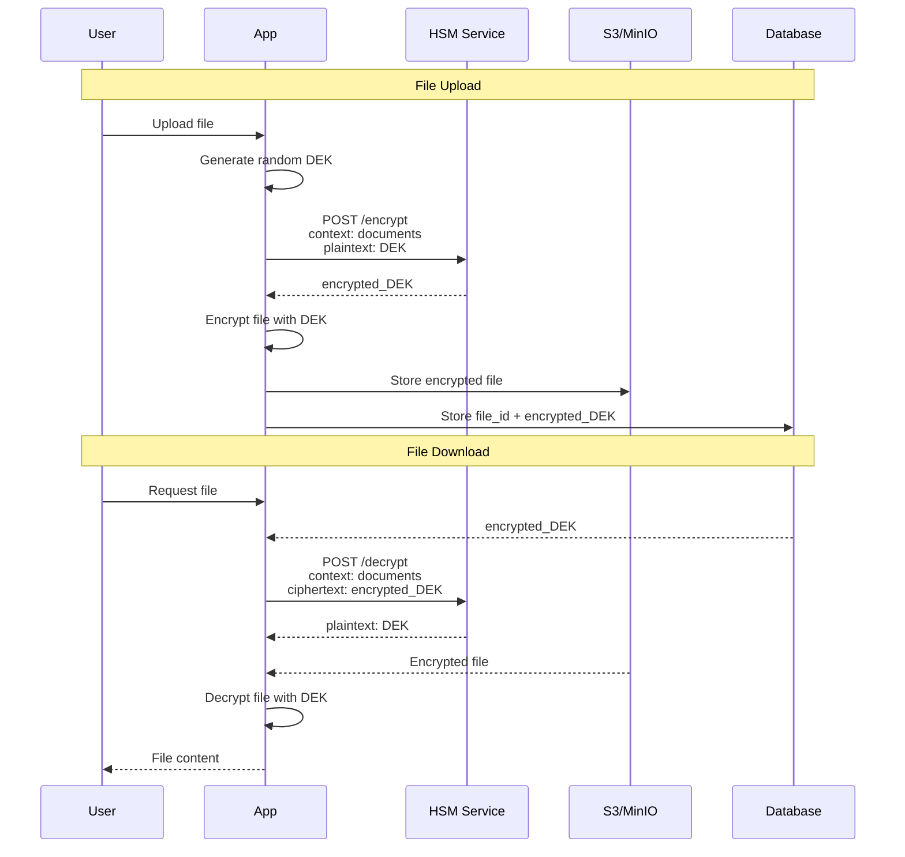

# 🔐 HSM Service - Centralized Cryptographic Key Management

> **📚 Документация**: Полный индекс документов с порядком изучения см. в [DOCS_INDEX.md](DOCS_INDEX.md)

Enterprise-grade HSM (Hardware Security Module) сервис для централизованного управления Key Encryption Keys (KEK) с поддержкой автоматической ротации, mTLS аутентификации и гранулярного контроля доступа.

---

## 🏗️ Архитектура

> **📖 Полная документация**: См. [ARCHITECTURE.md](ARCHITECTURE.md) для детального технического описания, компонентов и data flow

### Контекст использования


```mermaid
graph TB
    subgraph "Распределенные сервисы"
        TS1[Trading Service 1<br/>OU=Trading]
        TS2[Trading Service 2<br/>OU=Trading]
        WEB[Web 2FA Service<br/>OU=2FA]
        MOB[Mobile 2FA App<br/>OU=2FA]
    end
    
    subgraph "HSM Service"
        API[HTTPS API :8443<br/>mTLS Required]
        ACL[ACL Engine<br/>OU-based]
        CRYPTO[Crypto Engine<br/>AES-256-GCM]
        
        subgraph "SoftHSM v2"
            KEK1[kek-exchange-key-v1<br/>AES-256]
            KEK2[kek-2fa-v1<br/>AES-256]
        end
    end
    
    subgraph "Databases"
        DB1[(Trading DB<br/>encrypted DEKs)]
        DB2[(2FA DB<br/>encrypted secrets)]
    end
    
    TS1 -->|mTLS| API
    TS2 -->|mTLS| API
    WEB -->|mTLS| API
    MOB -->|mTLS| API
    
    API --> ACL
    ACL --> CRYPTO
    CRYPTO --> KEK1
    CRYPTO --> KEK2
    
    TS1 -.->|mTLS<br/>stores encrypted DEKs| DB1
    TS2 -.->|mTLS<br/>stores encrypted DEKs| DB1
    WEB -.->|mTLS<br/>stores encrypted secrets| DB2
```

**Ключевые принципы**:
- 🔒 KEK никогда не покидают HSM
- 🔐 Все соединения - mTLS (clients ↔ HSM, services ↔ DB)
- 🎯 ACL изолирует contexts по Organizational Unit
- 🔄 Zero-downtime ротация ключей
- 📊 Полный аудит всех операций

### Разделение конфигурации

Сервис использует двухфайловую архитектуру конфигурации для совместимости с GitOps/IaC:

**config.yaml** (статическая конфигурация, в Git)
- Типы ключей и политики ротации
- ACL правила и маппинг OU → contexts
- Настройки сервера и HSM
- Монтируется read-only (`:ro`)

**metadata.yaml** (динамические метаданные, вне Git)
- **Текущая активная версия** (`current`) для каждого контекста
- **Массив всех версий** (`versions`) - поддержка overlap period
- Временные метки создания и номера версий
- Обновляется автоматически при ротации
- Монтируется read-write (`:rw`)

Пример структуры metadata.yaml:
```yaml
rotation:
  exchange-key:
    current: kek-exchange-key-v2      # Активная версия для новых операций
    rotation_interval_days: 90        # PCI DSS compliance
    versions:
      - label: kek-exchange-key-v1    # Старая версия (для расшифровки)
        version: 1
        created_at: 2026-01-09T00:00:00.000000Z  # RFC3339 с микросекундами
      - label: kek-exchange-key-v2    # Новая версия
        version: 2
        created_at: 2026-01-16T10:30:00.000000Z
```

Это обеспечивает:
- ✅ **GitOps совместимость** (Ansible/Terraform не конфликтует с автоматической ротацией)
- ✅ **Immutable Infrastructure** (config.yaml read-only)
- ✅ **Key Overlap Period** (множественные версии ключей доступны одновременно)
- ✅ **Zero-downtime rotation** (старые данные расшифровываются v1, новые шифруются v2)
- ✅ **Простой rollback** (изменяется только metadata.yaml)

---

## 🧾 Логирование и аудит

HSM Service использует разделение **audit**, **access** и **error** логов с единым JSON форматом.

**Ключевые принципы:**
- Audit лог фиксирует каждое обращение к API и события доступа (для PCI DSS).
- Access лог фиксирует все HTTP запросы с минимальным набором полей.
- Error лог содержит системные сообщения, ошибки и диагностику.
- В каждый лог добавляется `request_id` для корреляции.
- Время логов: UTC, RFC3339 с микросекундами.
- Audit лог пишется в файл и в stdout (полезно для `docker logs`).
- Если лог‑директория недоступна для записи/ротации, сервис **не стартует**.

**Стандартные пути (конфигурируются):**
- `/var/log/hsm-service/audit.log`
- `/var/log/hsm-service/access.log`
- `/var/log/hsm-service/error.log`

**Пример logging конфигурации:**
```yaml
logging:
  level: info
  format: json
  error_path: /var/log/hsm-service/error.log
  audit_path: /var/log/hsm-service/audit.log
  access_path: /var/log/hsm-service/access.log
  max_size_mb: 100
  max_backups: 10
  max_age_days: 30
  compress: true
  audit_to_stdout: true
  access_to_stdout: true
  audit_mirror_to_error_on_debug: true
```

---

## 💡 Зачем это нужно?

### Проблема: Ключи шифрования везде

В современных распределенных системах каждый микросервис часто хранит свои ключи шифрования локально:

❌ **Проблемы традиционного подхода:**
- Ключи в environment variables или config файлах
- Каждый сервис имеет копию KEK → высокий риск утечки
- Невозможность централизованной ротации ключей
- Нет аудита криптографических операций
- При компрометации одного сервиса → все данные под угрозой
- Сложность управления ключами в multi-service архитектуре

### Решение: Централизованный HSM Service

✅ **HSM Service обеспечивает:**
- **Zero trust**: KEK НИКОГДА не покидают HSM - только шифрование/расшифровка
- **Централизация**: Один источник истины для всех ключей
- **Простая ротация**: Ротация KEK без перезапуска микросервисов
- **Аудит**: Полное логирование всех криптографических операций
- **mTLS + ACL**: Гранулярный контроль доступа по Organizational Unit
- **High Availability**: Stateless архитектура для горизонтального масштабирования

### 🏦 PCI DSS Compliance

HSM Service покрывает критические требования:

#### Requirement 3: Защита хранимых данных держателей карт

- **3.5.1** - Криптографические ключи защищены от несанкционированного доступа
  - ✅ KEK хранятся в SoftHSM (PKCS#11 interface)
  - ✅ Ключи НИКОГДА не экспортируются за пределы HSM
  - ✅ mTLS для всех соединений (TLS 1.3, strong ciphers)

- **3.6.1** - Полная документация криптографических ключей
  - ✅ `pki/inventory.yaml` - реестр всех KEK с версиями
  - ✅ `pki/revoked.yaml` - история отозванных ключей
  - ✅ Каждый ключ привязан к context (назначение)
  - ✅ ACL определяет custodian для каждого context

- **3.6.4** - Ротация ключей минимум раз в год (рекомендация: 90 дней)
  - ✅ **Автоматическая ротация каждые 90 дней**
  - ✅ Zero-downtime: старый KEK сохраняется для расшифровки
  - ✅ Плавный переход: новые данные шифруются новым KEK
  - ✅ Механизм re-encryption для миграции данных

- **3.7** - Минимизация доступа к ключам
  - ✅ Только HSM Service имеет доступ к KEK
  - ✅ ACL на уровне Organizational Unit (OU)
  - ✅ Context isolation (Trading не видит 2FA ключи)

#### Requirement 10: Журналирование и мониторинг

- **10.2.2** - Логирование всех действий привилегированных пользователей
  - ✅ Каждый encrypt/decrypt логируется с timestamp
  - ✅ Логи включают: client CN, OU, context, KEK alias
  - ✅ Интеграция с SIEM (Splunk, ELK, Grafana Loki)

- **10.3** - Audit trail для всех событий с ключами
  - ✅ Логи операций: encrypt, decrypt, rotate, revoke
  - ✅ Невозможность удаления/модификации логов
  - ✅ Retention policy: минимум 1 год (настраивается)

---

## 🎯 Где применять?

### Use Case 1: Защита данных в базах данных

**Проблема**: Нужно хранить sensitive данные (PII, платежные данные, пароли) в БД

**Решение**:


```mermaid
sequenceDiagram
    participant App as Application
    participant HSM as HSM Service
    participant DB as Database
    
    Note over App,DB: Encrypt Flow
    App->>HSM: POST /encrypt<br/>(plaintext: DEK, context: data-encryption)
    HSM->>HSM: Encrypt DEK with KEK
    HSM-->>App: ciphertext: encrypted_DEK
    App->>DB: Store encrypted_DEK
    
    Note over App,DB: Decrypt Flow
    DB-->>App: Retrieve encrypted_DEK
    App->>HSM: POST /decrypt<br/>(ciphertext: encrypted_DEK)
    HSM->>HSM: Decrypt with KEK
    HSM-->>App: plaintext: DEK
    App->>App: Use DEK to encrypt/decrypt data
```

**Применимо для**:
- E-commerce платформы (платежные данные)
- Healthcare системы (медицинские записи, HIPAA compliance)
- Banking приложения (транзакции, PCI DSS compliance)
- SaaS платформы (данные клиентов, GDPR compliance)

---

### Use Case 2: Microservices Architecture

**Проблема**: 50+ микросервисов, у каждого свои ключи для inter-service communication

**Решение**: Централизованное управление ключами через HSM Service


```mermaid
graph LR
    TS[Trading Service<br/>OU=Trading] -->|encrypt/decrypt<br/>context: exchange-key| HSM[HSM Service]
    TFA[2FA Service<br/>OU=2FA] -->|encrypt/decrypt<br/>context: 2fa| HSM
    BS[Billing Service<br/>OU=Billing] -->|encrypt/decrypt<br/>context: billing| HSM
    
    HSM --> KEK1[KEK: exchange-key]
    HSM --> KEK2[KEK: 2fa]
    HSM --> KEK3[KEK: billing]
    
    style HSM fill:#e1f5ff
    style KEK1 fill:#ffe1e1
    style KEK2 fill:#ffe1e1
    style KEK3 fill:#ffe1e1
```

**Преимущества**:
- Единая точка управления ключами для всех сервисов
- Автоматическая ротация без downtime
- Изоляция по contexts (каждый сервис видит только свои ключи)
- Аудит всех операций

---

### Use Case 3: Secrets Management

**Проблема**: Хранение secrets (API keys, tokens, credentials) в Vault/env vars

**Решение**: Шифрование secrets через HSM Service перед сохранением


```mermaid
flowchart LR
    S[Secret] -->|1. Encrypt| HSM[HSM Service]
    HSM -->|2. encrypted_secret| V[(Vault/DB)]
    
    V -->|3. Retrieve| HSM2[HSM Service]
    HSM2 -->|4. Decrypt| S2[Secret]
    
    style HSM fill:#e1f5ff
    style HSM2 fill:#e1f5ff
    style V fill:#fff4e1
```

**Применимо для**:
- CI/CD pipelines (credentials для deployment)
- API key management
- OAuth tokens хранение
- Database credentials rotation

---

### Use Case 4: Compliance (PCI DSS, GDPR, HIPAA)

**Проблема**: Регуляторы требуют ротацию ключей, аудит доступа, secure key storage

**HSM Service из коробки**:
- ✅ **PCI DSS Requirement 3.6.4**: Ротация KEK каждые 90 дней (автоматическая)
- ✅ **PCI DSS Requirement 3.5**: Защита ключей от unauthorized access (mTLS + ACL)
- ✅ **PCI DSS Requirement 3.6.1**: Full documentation ключей (inventory.yaml)
- ✅ **PCI DSS Requirement 3.7**: Минимизация доступа к ключам (ACL по OU)
- ✅ **PCI DSS Requirement 10.2**: Audit trail всех криптографических операций
- ✅ **GDPR Article 32**: Encryption of personal data
- ✅ **HIPAA**: Encryption and key management controls

#### 📋 Детальное соответствие PCI DSS v4.0

| Requirement | Описание | Реализация в HSM Service |
|------------|----------|--------------------------|
| **3.5.1** | Cryptographic keys secured against disclosure | KEK хранятся в SoftHSM (PKCS#11), никогда не экспортируются |
| **3.6.1.1** | Cryptographic keys documented | `pki/inventory.yaml` - полный реестр KEK с версиями |
| **3.6.1.2** | Key usage documented | Каждый KEK привязан к context (exchange, 2fa, billing) |
| **3.6.1.3** | Key custodian defined | ACL определяет, кто может использовать каждый context |
| **3.6.4** | Key rotation every 90 days | Автоматическая ротация через `POST /rotate/:context` |
| **3.7.1** | Minimize locations with keys | Только HSM Service имеет доступ к KEK |
| **3.7.2** | Minimum access to keys | ACL на уровне OU + context изоляция |
| **10.2.2** | All actions by privileged users | Логирование всех encrypt/decrypt операций |
| **10.3** | Audit trail for key events | Timestamps + client CN + context в логах |
| **12.3.2** | Cryptographic architecture documented | `ARCHITECTURE.md`, `API.md` |

**Пример audit log для PCI DSS 10.2**:
```json
{
  "timestamp": "2026-01-10T15:30:45Z",
  "client_cn": "trading-service-1.ct-system.local",
  "client_ou": "Trading",
  "operation": "encrypt",
  "context": "exchange-key",
  "kek_alias": "kek-exchange-key-v2",
  "status": "success",
  "request_id": "req-abc123"
}
```

**Для PCI DSS audit**: экспортируйте логи в SIEM (Splunk/ELK), настройте алерты на unauthorized access attempts.

---

### Use Case 5: Multi-Tenant SaaS

**Проблема**: Каждый tenant требует изоляции данных

**Решение**: Dedicated context для каждого tenant


```mermaid
graph TD
    TA[Tenant A] -->|context: tenant-a-data| HSM[HSM Service]
    TB[Tenant B] -->|context: tenant-b-data| HSM
    TC[Tenant C] -->|context: tenant-c-data| HSM
    
    HSM --> ACL{ACL Engine}
    ACL --> KA[KEK: tenant-a]
    ACL --> KB[KEK: tenant-b]
    ACL --> KC[KEK: tenant-c]
    
    style HSM fill:#e1f5ff
    style ACL fill:#e1ffe1
    style KA fill:#ffe1e1
    style KB fill:#ffe1e1
    style KC fill:#ffe1e1
```

**ACL гарантирует**: Tenant A не может расшифровать данные Tenant B

---

### Use Case 6: 2FA/MFA Token Protection

**Проблема**: Секреты для TOTP/HOTP (Google Authenticator, Authy) хранятся в БД в открытом виде

**Риски**:
- При утечке БД злоумышленник получает все TOTP seeds
- Может генерировать валидные 2FA коды для ВСЕХ пользователей
- Обход двухфакторной аутентификации

**Решение через HSM Service**:


```mermaid
sequenceDiagram
    participant U as User
    participant W as Web App
    participant H as HSM Service
    participant D as Database
    
    Note over U,D: 2FA Registration
    U->>W: Enable 2FA
    W->>H: POST /encrypt<br/>context: 2fa-totp<br/>plaintext: TOTP_seed
    H->>H: Encrypt with KEK
    H-->>W: ciphertext: enc_abc123...
    W->>D: Store encrypted TOTP secret
    
    Note over U,D: 2FA Verification
    U->>W: Enter code "123456"
    D-->>W: encrypted TOTP secret
    W->>H: POST /decrypt<br/>context: 2fa-totp<br/>ciphertext: enc_abc123...
    H->>H: Decrypt with KEK
    H-->>W: plaintext: TOTP_seed
    W->>W: Generate TOTP & verify
    W-->>U: ✅ Authorized
```

**Защита**:
- ✅ TOTP secrets НИКОГДА не хранятся в открытом виде
- ✅ При компрометации БД → все secrets зашифрованы
- ✅ Ротация KEK → re-encrypt всех 2FA secrets без action от пользователей
- ✅ ACL изоляция: только сервисы с OU=2FA могут расшифровать

**Применимо для**:
- Banking apps (мобильное приложение банка)
- Corporate SSO (Okta, Azure AD)
- Crypto exchanges (защита аккаунтов)
- Admin panels (защита privileged доступа)

---

### Use Case 7: JWT Token Signing Keys

**Проблема**: Private keys для подписи JWT токенов хранятся в файлах/env vars

**Решение**: Централизованное хранение signing keys в HSM


```mermaid
sequenceDiagram
    participant C as Client
    participant AS as Auth Service
    participant AG as API Gateway
    participant H as HSM Service
    
    Note over C,H: JWT Signing
    C->>AS: Login request
    AS->>H: POST /encrypt<br/>context: jwt-signing<br/>plaintext: session_data
    H-->>AS: encrypted payload
    AS->>AS: Create JWT with encrypted payload
    AS-->>C: JWT token
    
    Note over C,H: JWT Verification
    C->>AG: API request + JWT
    AG->>H: POST /decrypt<br/>context: jwt-signing<br/>ciphertext: jwt_payload
    H-->>AG: decrypted session_data
    AG->>AG: Verify & authorize
    AG-->>C: API response
```

**Преимущества**:
- ✅ Private key для JWT НИКОГДА не покидает HSM
- ✅ Ротация signing key без invalidation старых токенов
- ✅ Multi-version support (v1, v2, v3 ключей одновременно)
- ✅ Аудит: кто и когда подписал/проверил токен

---

### Use Case 8: File Encryption (Document Management)

**Проблема**: Загруженные файлы (паспорта, договоры, медкарты) в S3/MinIO в открытом виде

**Решение**: Client-side encryption через HSM Service


```mermaid
sequenceDiagram
    participant U as User
    participant A as App
    participant H as HSM Service
    participant S as S3/MinIO
    participant D as Database
    
    Note over U,D: File Upload
    U->>A: Upload file
    A->>A: Generate random DEK
    A->>H: POST /encrypt<br/>context: documents<br/>plaintext: DEK
    H-->>A: encrypted_DEK
    A->>A: Encrypt file with DEK
    A->>S: Store encrypted file
    A->>D: Store file_id + encrypted_DEK
    
    Note over U,D: File Download
    U->>A: Request file
    D-->>A: encrypted_DEK
    A->>H: POST /decrypt<br/>context: documents<br/>ciphertext: encrypted_DEK
    H-->>A: plaintext: DEK
    S-->>A: Encrypted file
    A->>A: Decrypt file with DEK
    A-->>U: File content
```

**Use cases**:
- 📄 Legal tech (договоры, NDA)
- 🏥 Healthcare (медицинские карты, HIPAA)
- 🏦 Banking (документы KYC)
- 📋 HR системы (резюме, персональные данные)

---

### Use Case 9: Database Column Encryption (Transparent)

**Проблема**: Миграция существующей БД на шифрование без изменения application code

**Решение**: Database triggers + HSM Service

```sql
-- PostgreSQL trigger для автоматического шифрования
CREATE TRIGGER encrypt_pii
  BEFORE INSERT OR UPDATE ON users
  FOR EACH ROW
  EXECUTE FUNCTION encrypt_via_hsm(NEW.email, NEW.phone);

-- Function вызывает HSM API
CREATE FUNCTION encrypt_via_hsm(email TEXT, phone TEXT)
  RETURNS TRIGGER AS $$
  BEGIN
    NEW.email = http_post('https://hsm:8443/encrypt', 
      json_build_object('plaintext', email, 'context', 'user-pii'));
    NEW.phone = http_post('https://hsm:8443/encrypt',
      json_build_object('plaintext', phone, 'context', 'user-pii'));
    RETURN NEW;
  END;
$$ LANGUAGE plpgsql;
```

**Преимущества**:
- ✅ Zero application code changes
- ✅ Transparent encryption/decryption
- ✅ Централизованная ротация ключей
- ✅ Поддержка legacy систем

---

## 🔑 Управление ключами

**Подробная информация** → см. [PKI_SETUP.md](PKI_SETUP.md) для настройки PKI и [QUICKSTART_DOCKER.md](QUICKSTART_DOCKER.md) для первого запуска

### Проверка статуса ротации

```bash
docker exec hsm-service /app/hsm-admin rotation-status
```

### Ротация ключа

```bash
# 1. Проверить что ключи готовы к ротации
docker exec hsm-service /app/hsm-admin rotation-status

# 2. Выполнить ротацию (создаёт новую версию ключа)
docker exec hsm-service /app/hsm-admin rotate exchange-key

# 3. Перезапустить сервис для загрузки новой версии
docker restart hsm-service

# 4. Проверить что обе версии доступны
docker exec hsm-service /app/hsm-admin rotation-status

# 5. Очистить старые версии (опционально, через 30+ дней)
docker exec hsm-service /app/hsm-admin cleanup-old-versions --dry-run
docker exec hsm-service /app/hsm-admin cleanup-old-versions
```

**Важно:**
- После ротации доступны **обе версии** ключа (overlap period)
- Новые операции encrypt используют v2
- Старые данные можно расшифровать ключом v1
- Автоматический cleanup удалит версии старше 30 дней (или при превышении max_versions=3)
- Используйте `--dry-run` для предварительного просмотра

## 🛡️ Безопасность

### ACL Маппинг

| Organizational Unit | Разрешенные Contexts |
|---------------------|---------------------|
| Trading             | exchange-key        |
| 2FA                 | 2fa                 |
| Database            | (нет доступа)       |

### Требования к клиентским сертификатам

- Должны быть выданы доверенным CA (указан в `config.yaml`)
- CN должен быть уникальным
- OU должен быть определен в ACL маппинге
- Сертификат не должен быть отозван (проверка по `revoked.yaml`)

### Certificate Revocation (Отзыв сертификатов)

**Автоматическая перезагрузка списка отзыва:**
- ✅ HSM Service автоматически перезагружает `revoked.yaml` **каждые 30 секунд** без перезапуска
- ✅ Проверка файла только при изменении (по modTime) - минимальная нагрузка
- ✅ Валидация перед применением: битый YAML не загружается, старые данные сохраняются
- ✅ Atomic update: либо все записи применяются, либо ни одна
- ✅ Thread-safe: concurrent reads во время reload

**Формат revoked.yaml:**
```yaml
revoked:
  - cn: "client1.example.com"
    serial: "1A:2B:3C:4D"
    reason: "key-compromise"
    date: "2024-01-15"
  
  - cn: "old-service.example.com"
    serial: "5E:6F:7A:8B"
    reason: "cessation-of-operation"
    date: "2024-02-01"
```

**Отзыв сертификата:**
```bash
# Автоматически добавляет в revoked.yaml
cd pki
./scripts/revoke-cert.sh client1.example.com "key-compromise"

# Изменения применятся автоматически в течение 30 секунд
# Клиент client1.example.com получит 403 Forbidden
```

**Защита от ошибок:**
- Пустые CN отклоняются
- Дубликаты CN обнаруживаются  
- Невалидный YAML не применяется
- При удалении файла список очищается (никто не блокируется)

### TLS/Transport Security

**TLS 1.3 ONLY** - Намеренное решение безопасности:
- ✅ **Обязательное требование:** Все клиенты ДОЛЖНЫ поддерживать TLS 1.3
- ✅ **Нет fallback на TLS 1.2** - устаревшие протоколы отключены
- ✅ **Причины:**
  - TLS 1.3 убирает слабые алгоритмы (RC4, 3DES, MD5, SHA-1)
  - Обязательная Perfect Forward Secrecy (PFS)
  - Шифрование handshake (защита метаданных)
  - Упрощенная конфигурация cipher suites
  - PCI DSS 4.0 настоятельно рекомендует TLS 1.3+
- ✅ **Совместимость:** Все современные клиенты поддерживают TLS 1.3 с 2018 года
  - Go 1.13+ (2019)
  - OpenSSL 1.1.1+ (2018)
  - Python 3.7+ (2018)
  - Node.js 12+ (2019)
  - Java 11+ (2018)
  - Все современные браузеры

**Cipher Suites (только TLS 1.3):**
- `TLS_AES_256_GCM_SHA384` - основной (AES-256-GCM)
- `TLS_CHACHA20_POLY1305_SHA256` - для mobile/ARM оптимизация

**Mutual TLS (mTLS):**
- Обязательная клиентская аутентификация через сертификаты
- Проверка цепочки сертификатов до доверенного CA
- Валидация CN и OU клиента

### Ротация ключей

- **Интервал по умолчанию:** 90 дней (PCI DSS Requirement 3.6.4)
- **Период перекрытия (overlap):** Безлимитный - все версии ключей доступны одновременно
- **Retention Policy:** 
  - Max версий: 3 (настраивается через `max_versions`)
  - Auto-cleanup: версии старше 30 дней (настраивается через `cleanup_after_days`)
  - PCI DSS compliant - автоматическая очистка устаревших ключей
- **Версионирование:** kek-exchange-key-v1 → kek-exchange-key-v2 → kek-exchange-key-v3...
- **Динамические ID:** Каждая версия получает уникальный 16-значный hex ID на основе timestamp
- **Zero-downtime:** Старые данные расшифровываются v1, новые шифруются v2
- **Автоматические проверки:** При старте сервиса проверяются просроченные ключи и избыточные версии

## 🔧 Конфигурация

### config.yaml

```yaml
hsm:
  pkcs11_lib: /usr/lib/softhsm/libsofthsm2.so
  slot_id: hsm-token
  metadata_file: /app/metadata.yaml
  max_versions: 3           # Maximum key versions to keep (PCI DSS)
  cleanup_after_days: 30    # Auto-delete versions older than N days
  keys:
    exchange-key:
      type: aes
    2fa:
      type: aes

acl:
  revoked_file: /app/pki/revoked.yaml
  mappings:
    Trading: [exchange-key]
    2FA: [2fa]
```

**Rotation policy** настраивается в `metadata.yaml`:
```yaml
rotation:
  exchange-key:
    rotation_interval_days: 90  # PCI DSS compliant
    current: kek-exchange-key-v1
    versions: [...]
```

### metadata.yaml

```yaml
rotation:
  exchange-key:
    current: kek-exchange-key-v2     # Текущая активная версия
    versions:
      - label: kek-exchange-key-v1   # Старая версия (доступна для decrypt)
        version: 1
        created_at: 2026-01-09T00:00:00.000000Z  # Всегда с микросекундами
      - label: kek-exchange-key-v2   # Новая версия (используется для encrypt)
        version: 2
        created_at: 2026-01-16T10:30:00.000000Z
  
  2fa:
    current: kek-2fa-v1
    versions:
      - label: kek-2fa-v1
        version: 1
        created_at: 2026-01-09T00:00:00.000000Z
```

### Environment Variables

```bash
# Обязательно
HSM_PIN=1234              # PIN для доступа к HSM токену

# Опционально
CONFIG_PATH=/app/config.yaml
LOG_LEVEL=info
```

## 📊 Мониторинг

### Health Check

```bash
curl https://hsm-service.local:8443/health
```

**Response:**
```json
{
  "status": "healthy",
  "hsm_initialized": true,
  "active_keys": 2,
  "timestamp": "2025-01-10T10:30:00Z"
}
```

### Метрики (если включено)

- `hsm_encrypt_total` - Количество операций encrypt
- `hsm_decrypt_total` - Количество операций decrypt
- `hsm_encrypt_duration_seconds` - Latency encrypt операций
- `hsm_decrypt_duration_seconds` - Latency decrypt операций
- `hsm_acl_denied_total` - Количество отказов ACL

## 📝 Audit Logging (PCI DSS 10.2)

### Обзор

HSM Service реализует **полное audit logging** всех криптографических операций в соответствии с требованием PCI DSS 10.2 ("Audit logs must be implemented to track all access to system components").

### Что логируется

**Каждый запрос /encrypt и /decrypt записывается в audit log** со следующими полями:

| Поле | Описание | Пример |
|------|----------|--------|
| `timestamp` | ISO 8601 timestamp | `2026-01-15T10:30:45Z` |
| `client_cn` | Common Name из клиентского сертификата | `trading-service-1` |
| `client_ou` | Organizational Unit клиента | `Trading` |
| `client_ip` | IP адрес клиента | `10.0.0.15` |
| `operation` | Тип операции | `encrypt` или `decrypt` |
| `context` | Контекст ключа | `exchange-key`, `2fa` |
| `key_id` | Использованный KEK | `kek-exchange-key-v2` |
| `status` | Статус операции | `success` или `error` |
| `error` | Сообщение об ошибке (если есть) | `acl_denied: OU not allowed` |
| `duration_ms` | Время выполнения в миллисекундах | `12` |
| `request_id` | Уникальный ID запроса | `req-abc123def456` |

### Что НЕ логируется (Security Best Practice)

**Критически важно:** Следующие данные **НИКОГДА** не попадают в логи:

- ❌ **plaintext** - расшифрованные данные
- ❌ **ciphertext** - зашифрованные данные  
- ❌ **nonce** - криптографические nonce
- ❌ **tags** - authentication tags
- ❌ **HSM PIN** - credentials для доступа к HSM
- ❌ **KEK handles** - внутренние PKCS#11 handles

Это защищает от утечки чувствительных данных через логи.

### Формат логов

**JSON structured logging (по умолчанию):**

```json
{
  "time": "2026-01-15T10:30:45Z",
  "level": "INFO",
  "component": "audit",
  "msg": "request",
  "client_cn": "trading-service-1",
  "client_ou": "Trading",
  "client_ip": "10.0.0.15:54321",
  "method": "POST",
  "path": "/encrypt",
  "operation": "encrypt",
  "context": "exchange-key",
  "key_id": "kek-exchange-key-v2",
  "status": "success",
  "duration_ms": 12,
  "request_id": "req-abc123def456"
}
```

**Text format (для debugging):**

```
time=2026-01-15T10:30:45Z level=INFO component=audit msg=request client_cn=trading-service-1 client_ou=Trading operation=encrypt context=exchange-key key_id=kek-exchange-key-v2 status=success duration_ms=12
```

### Конфигурация

**config.yaml:**
```yaml
logging:
  level: info      # Уровни: debug, info, warn, error
  format: json     # Форматы: json, text
```

**Environment Variables:**
```bash
LOG_LEVEL=info     # Переопределяет config.yaml
LOG_FORMAT=json    # Переопределяет config.yaml
```

### Где хранятся логи

**Docker (stdout → Docker logging driver):**

HSM Service пишет логи в **stdout**, которые Docker перехватывает и сохраняет через logging driver.

**Физическое расположение:**
```bash
# По умолчанию (json-file driver):
/var/lib/docker/containers/<CONTAINER_ID>/<CONTAINER_ID>-json.log

# Найти путь к логам конкретного контейнера:
CONTAINER_ID=$(docker compose ps -q hsm-service)
docker inspect $CONTAINER_ID | jq '.[0].LogPath'
# Вывод: "/var/lib/docker/containers/abc123.../abc123...-json.log"

# Прямой доступ к файлу (требует root):
sudo tail -f /var/lib/docker/containers/$(docker compose ps -q hsm-service)/$(docker compose ps -q hsm-service)-json.log
```

**Просмотр через Docker CLI:**
```bash
# Просмотр логов
docker compose logs -f hsm-service

# Фильтр только audit events
docker compose logs hsm-service | grep '"component":"audit"'

# Поиск конкретного клиента
docker compose logs hsm-service | jq 'select(.client_cn=="trading-service-1")'

# Экспорт в файл
docker compose logs hsm-service > /var/log/hsm/audit.log
```

**Ротация логов в Docker:**

```yaml
# docker-compose.yml
services:
  hsm-service:
    logging:
      driver: "json-file"
      options:
        max-size: "100m"    # Максимальный размер файла лога
        max-file: "10"      # Количество файлов (100m * 10 = 1GB)
        compress: "true"    # Сжатие старых логов
```

После этого логи будут ротироваться автоматически:
```
/var/lib/docker/containers/<id>/<id>-json.log       (активный)
/var/lib/docker/containers/<id>/<id>-json.log.1.gz  (архив)
/var/lib/docker/containers/<id>/<id>-json.log.2.gz
...
```

**Production (systemd + journald):**

HSM Service пишет логи в **stdout**, которые systemd перехватывает и сохраняет в **journald**.

**Физическое расположение:**
```bash
# Журналы systemd хранятся в бинарном формате:
/var/log/journal/<MACHINE_ID>/system.journal
/var/log/journal/<MACHINE_ID>/user-*.journal

# Найти MACHINE_ID:
cat /etc/machine-id

# Пример:
/var/log/journal/a1b2c3d4e5f6.../system.journal

# Размер логов:
sudo journalctl --disk-usage
# Вывод: "Archived and active journals take up 512.0M in the file system."
```

**Просмотр через journalctl:**
```bash
# Просмотр логов hsm-service
journalctl -u hsm-service -f

# Только audit events
journalctl -u hsm-service | grep '"component":"audit"'

# С временным диапазоном
journalctl -u hsm-service --since "2026-01-15 00:00:00" --until "2026-01-15 23:59:59"

# JSON формат для экспорта
journalctl -u hsm-service -o json > /var/log/hsm/audit.json

# Последние 100 строк
journalctl -u hsm-service -n 100

# Показать логи с момента последней загрузки
journalctl -u hsm-service -b
```

**Конфигурация ротации (journald):**

```bash
# /etc/systemd/journald.conf
[Journal]
Storage=persistent           # Хранить на диске (не только в RAM)
SystemMaxUse=10G            # Максимум места на диске
SystemKeepFree=5G           # Оставить минимум 5GB свободными
MaxRetentionSec=31536000    # 1 год (365 дней) для PCI DSS
MaxFileSec=2592000          # Новый файл раз в 30 дней
Compress=yes                # Сжимать старые логи

# Применить изменения:
sudo systemctl restart systemd-journald

# Проверить статус:
sudo journalctl --verify
```

**Экспорт в текстовый файл (для долгосрочного хранения):**

```bash
# Создать директорию для audit логов
sudo mkdir -p /var/log/hsm-service

# Ежедневный экспорт через cron
# /etc/cron.daily/hsm-audit-export
#!/bin/bash
journalctl -u hsm-service \
  --since "yesterday" \
  --until "today" \
  -o json \
  | gzip > /var/log/hsm-service/audit-$(date -d yesterday +%Y-%m-%d).json.gz

# Экспорт только audit events:
journalctl -u hsm-service \
  --since "yesterday" \
  --until "today" \
  -o json \
  | grep '"component":"audit"' \
  | gzip > /var/log/hsm-service/audit-$(date -d yesterday +%Y-%m-%d).json.gz
```

### Интеграция с SIEM

**Отправка в ELK (Elasticsearch + Logstash + Kibana):**

```yaml
# docker-compose.yml
services:
  hsm-service:
    logging:
      driver: "syslog"
      options:
        syslog-address: "tcp://logstash:5000"
        tag: "hsm-service"
```

**Или через Filebeat:**

```yaml
# filebeat.yml
filebeat.inputs:
  - type: container
    paths:
      - '/var/lib/docker/containers/*/*.log'
    processors:
      - add_docker_metadata: ~
      - decode_json_fields:
          fields: ["message"]
          target: ""

output.elasticsearch:
  hosts: ["elasticsearch:9200"]
  index: "hsm-audit-%{+yyyy.MM.dd}"
```

**Splunk:**

```bash
# Отправка через HTTP Event Collector
docker compose logs -f hsm-service | \
  grep '"component":"audit"' | \
  while read line; do
    curl -X POST https://splunk:8088/services/collector \
      -H "Authorization: Splunk YOUR-HEC-TOKEN" \
      -d "{\"event\": $line}"
  done
```

### Примеры аудита

**1. Успешное шифрование:**
```json
{
  "time": "2026-01-15T10:30:45Z",
  "level": "INFO",
  "component": "audit",
  "msg": "request",
  "client_cn": "trading-service-1",
  "client_ou": "Trading",
  "operation": "encrypt",
  "context": "exchange-key",
  "key_id": "kek-exchange-key-v2",
  "status": "success",
  "duration_ms": 12
}
```

**2. ACL отказ:**
```json
{
  "time": "2026-01-15T10:31:00Z",
  "level": "WARN",
  "component": "audit",
  "msg": "request",
  "client_cn": "unauthorized-service",
  "client_ou": "Unknown",
  "operation": "decrypt",
  "context": "exchange-key",
  "status": "error",
  "error": "acl_denied: OU 'Unknown' not allowed for context 'exchange-key'",
  "duration_ms": 2
}
```

**3. Отозванный сертификат:**
```json
{
  "time": "2026-01-15T10:32:00Z",
  "level": "WARN",
  "component": "audit",
  "msg": "request",
  "client_cn": "compromised-service",
  "client_ou": "Trading",
  "operation": "encrypt",
  "status": "error",
  "error": "certificate_revoked: CN 'compromised-service' found in revoked.yaml",
  "duration_ms": 1
}
```

**4. Ротация ключа:**
```json
{
  "time": "2026-01-15T14:30:00Z",
  "level": "INFO",
  "component": "audit",
  "msg": "key_rotation",
  "context": "exchange-key",
  "old_key": "kek-exchange-key-v1",
  "new_key": "kek-exchange-key-v2",
  "performed_by": "hsm-admin",
  "reason": "scheduled_90day_rotation"
}
```

### Соответствие PCI DSS

| Требование | Реализация | Подтверждение |
|------------|-----------|---------------|
| **10.2.2** | Audit log всех действий привилегированных пользователей | ✅ Логирование всех encrypt/decrypt операций |
| **10.3.1** | User identification | ✅ client_cn из mTLS сертификата |
| **10.3.2** | Type of event | ✅ operation (encrypt/decrypt) |
| **10.3.3** | Date and time | ✅ timestamp (ISO 8601) |
| **10.3.4** | Success/failure | ✅ status (success/error) |
| **10.3.5** | Origination of event | ✅ client_ip |
| **10.3.6** | Identity of affected data | ✅ context, key_id |
| **10.4** | Time synchronization | ✅ UTC timestamps (NTP на серверах) |
| **10.5** | Protect audit logs | ✅ Read-only монтирование, SIEM интеграция |
| **10.6** | Review logs daily | 📊 Настройка алертов в SIEM |

### Retention Policy (PCI DSS 10.7)

**Минимальные требования:**
- Аудит логи должны храниться минимум **1 год**
- Минимум **3 месяца** должны быть онлайн (доступны для быстрого анализа)

**Рекомендуемая конфигурация:**

```bash
# Journald (systemd)
# /etc/systemd/journald.conf
[Journal]
SystemMaxUse=10G          # Максимум места на диске
MaxRetentionSec=31536000  # 1 год (365 дней)
MaxFileSec=2592000        # Ротация раз в 30 дней

# Применить
sudo systemctl restart systemd-journald
```

```yaml
# Docker logging driver
services:
  hsm-service:
    logging:
      driver: "json-file"
      options:
        max-size: "100m"      # Макс размер файла
        max-file: "365"       # 365 файлов = ~1 год
```

**Архивация в S3/MinIO:**

```bash
#!/bin/bash
# /etc/cron.daily/hsm-log-archive

# Экспорт логов старше 3 месяцев в S3
journalctl -u hsm-service \
  --since "1 year ago" \
  --until "3 months ago" \
  -o json > /tmp/hsm-audit-archive.json

# Сжатие
gzip /tmp/hsm-audit-archive.json

# Загрузка в S3
aws s3 cp /tmp/hsm-audit-archive.json.gz \
  s3://audit-logs/hsm-service/$(date +%Y-%m-%d).json.gz

# Очистка
rm /tmp/hsm-audit-archive.json.gz
```

### Мониторинг и алерты

**Пример Grafana Dashboard:**

```sql
-- Kibana/Elasticsearch query
-- Количество encrypt операций по клиентам (за последние 24 часа)
{
  "query": {
    "bool": {
      "must": [
        {"match": {"component": "audit"}},
        {"match": {"operation": "encrypt"}},
        {"range": {"time": {"gte": "now-24h"}}}
      ]
    }
  },
  "aggs": {
    "by_client": {
      "terms": {"field": "client_cn.keyword"}
    }
  }
}
```

**Алерты (Prometheus AlertManager):**

```yaml
# alerts.yml
groups:
  - name: hsm_audit
    rules:
      # Высокая частота ACL отказов
      - alert: HighACLDenialRate
        expr: rate(hsm_acl_denied_total[5m]) > 10
        for: 5m
        annotations:
          summary: "High rate of ACL denials"
          description: "More than 10 ACL denials per second in the last 5 minutes"
      
      # Использование отозванного сертификата
      - alert: RevokedCertificateAttempt
        expr: increase(hsm_revoked_cert_attempts[1h]) > 0
        annotations:
          summary: "Revoked certificate access attempt"
          description: "Someone attempted to use a revoked certificate"
```

### Troubleshooting

**Логи не появляются:**

```bash
# Проверить уровень логирования
grep "level:" /app/config.yaml

# Проверить, что component=audit не фильтруется
docker compose logs hsm-service | grep audit | head -5

# Включить debug для диагностики
export LOG_LEVEL=debug
docker compose restart hsm-service
```

**Слишком много логов:**

```bash
# Фильтр только ошибок
docker compose logs hsm-service | jq 'select(.status=="error")'

# Уменьшить verbosity
logging:
  level: warn  # Только предупреждения и ошибки
```

**Логи не пишутся в файл:**

```bash
# Docker: перенаправление stdout в файл
docker compose logs -f hsm-service >> /var/log/hsm/audit.log &

# Systemd: использовать journald с форвардингом
journalctl -u hsm-service -f -o json | tee /var/log/hsm/audit.json
```

## 🐳 Docker Compose

```yaml
services:
  hsm-service:
    build: .
    ports:
      - "8443:8443"
    environment:
      - HSM_PIN=${HSM_PIN}
    volumes:
      - ./config.yaml:/app/config.yaml:ro          # Статическая конфигурация
      - ./metadata.yaml:/app/metadata.yaml:rw      # Динамические метаданные
      - ./pki:/app/pki:ro                          # PKI certificates
      - ./data/tokens:/var/lib/softhsm/tokens      # HSM storage
    restart: unless-stopped
```

## 🧪 Тестирование

```bash
# Unit tests
go test ./internal/...

# Integration tests
./tests/integration/full-integration-test.sh
```

---

## 📚 Документация

**Начните здесь**: [DOCS_INDEX.md](DOCS_INDEX.md) - Полный индекс всей документации с порядком чтения

### 🚀 Начало работы

| Документ | Описание | Время |
|----------|----------|-------|
| [PKI_SETUP.md](PKI_SETUP.md) | Настройка PKI (CA, сертификаты) | 15 мин |
| [QUICKSTART_DOCKER.md](QUICKSTART_DOCKER.md) | Быстрый старт (Docker) | 5 мин |
| [BUILD.md](BUILD.md) | Сборка бинарников для production | 15 мин |

### 🏗️ Архитектура и спецификации

| Документ | Описание | Время |
|----------|----------|-------|
| [ARCHITECTURE.md](ARCHITECTURE.md) | Детальная архитектура системы | 20 мин |
| [API.md](API.md) | Полная документация REST API | 15 мин |

### 🔧 Разработка и развертывание

| Документ | Описание | Время |
|----------|----------|-------|
| [BUILD.md](BUILD.md) | Сборка бинарников для production | 15 мин |
| [PRODUCTION_DEBIAN.md](PRODUCTION_DEBIAN.md) | Production на Debian 13 + nftables | 30 мин |

### 🔑 Управление ключами и сертификатами

| Документ | Описание | Время |
|----------|----------|-------|
| [KEY_ROTATION.md](KEY_ROTATION.md) | Процедуры ротации ключей | 15 мин |
| [PKI_SETUP.md](PKI_SETUP.md) | Полное руководство по PKI: CA, сертификаты, отзыв | 25 мин |

### 🛠️ Инструменты и CLI

| Документ | Описание | Время |
|----------|----------|-------|
| [CLI_TOOLS.md](CLI_TOOLS.md) | hsm-admin command reference | 10 мин |
| [scripts/README.md](scripts/README.md) | Скрипты автоматизации | 10 мин |

### 📊 Мониторинг и troubleshooting

| Документ | Описание | Время |
|----------|----------|-------|
| [MONITORING.md](MONITORING.md) | Prometheus + Grafana | 15 мин |
| [TROUBLESHOOTING.md](TROUBLESHOOTING.md) | Решение проблем и FAQ | 15 мин |

### 💾 Backup и тестирование

| Документ | Описание | Время |
|----------|----------|-------|
| [BACKUP_RESTORE.md](BACKUP_RESTORE.md) | Backup и DR | 10 мин |
| [tests/README.md](tests/README.md) | Руководство по тестированию | 20 мин |
| [EXTREME_TEST_RESULTS.md](EXTREME_TEST_RESULTS.md) | Результаты нагрузочного тестирования | 15 мин |

**Всего 20 документов**, ~15,000 строк, полное покрытие от quick start до production deployment.

---

## 📝 Логирование

Все криптографические операции логируются:

```json
{
  "level": "info",
  "time": "2025-01-10T10:30:00Z",
  "msg": "Encrypt operation",
  "client_cn": "hsm-trading-client-1",
  "client_ou": "Trading",
  "context": "exchange-key",
  "key_id": "kek-exchange-key-v2",
  "operation": "encrypt",
  "duration_ms": 12
}
```

## 🤝 Поддержка

- Email: titaev@gmail.com

## 📄 Лицензия

См. [LICENSE](LICENSE)

## 🔗 Полезные ссылки

- [PKCS#11 Specification](http://docs.oasis-open.org/pkcs11/pkcs11-base/v2.40/pkcs11-base-v2.40.html)
- [PCI DSS Requirements](https://www.pcisecuritystandards.org/)
- [SoftHSM Documentation](https://www.opendnssec.org/softhsm/)
